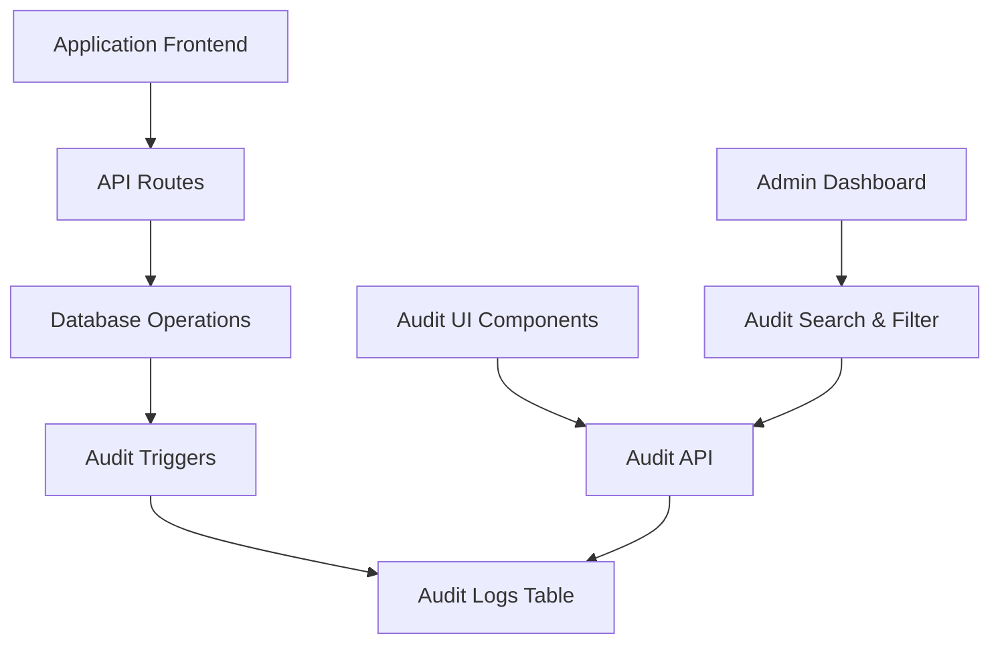

# Design Document - Système d'Audit

## Overview

Le système d'audit est conçu pour fournir une traçabilité complète des opérations CRUD sur les entités critiques de l'application : transactions, tâches, réservations et lofts. Il utilise une approche basée sur des triggers de base de données pour garantir la cohérence et des composants React pour l'affichage des données d'audit.

### Objectifs de conception
- **Performance** : Impact minimal sur les opérations normales
- **Fiabilité** : Enregistrement automatique via triggers de base de données
- **Sécurité** : Logs inaltérables avec contrôle d'accès strict
- **Utilisabilité** : Interface intuitive pour consulter l'historique

## Architecture

### Vue d'ensemble du système



### Composants principaux

1. **Audit Database Layer** : Tables et triggers pour l'enregistrement automatique
2. **Audit API Layer** : Services pour récupérer et formater les données d'audit
3. **Audit UI Components** : Composants React pour afficher l'historique
4. **Permission System** : Contrôle d'accès basé sur les rôles

## Components and Interfaces

### 1. Database Schema

#### Table principale d'audit
```sql
CREATE TABLE audit_logs (
    id UUID PRIMARY KEY DEFAULT gen_random_uuid(),
    table_name VARCHAR(50) NOT NULL,
    record_id UUID NOT NULL,
    action VARCHAR(10) NOT NULL, -- 'INSERT', 'UPDATE', 'DELETE'
    user_id UUID REFERENCES profiles(id),
    user_email VARCHAR(255),
    timestamp TIMESTAMP WITH TIME ZONE DEFAULT NOW(),
    old_values JSONB,
    new_values JSONB,
    changed_fields TEXT[],
    ip_address INET,
    user_agent TEXT,
    created_at TIMESTAMP WITH TIME ZONE DEFAULT NOW()
);
```

#### Index pour les performances
```sql
CREATE INDEX idx_audit_logs_table_record ON audit_logs(table_name, record_id);
CREATE INDEX idx_audit_logs_user_id ON audit_logs(user_id);
CREATE INDEX idx_audit_logs_timestamp ON audit_logs(timestamp);
CREATE INDEX idx_audit_logs_action ON audit_logs(action);
```

### 2. Triggers de base de données

#### Fonction générique d'audit
```sql
CREATE OR REPLACE FUNCTION audit_trigger_function()
RETURNS TRIGGER AS $$
DECLARE
    user_info RECORD;
    changed_fields TEXT[] := '{}';
    field_name TEXT;
BEGIN
    -- Récupérer les informations utilisateur depuis le contexte
    SELECT id, email INTO user_info 
    FROM profiles 
    WHERE id = current_setting('app.current_user_id', true)::UUID;
    
    -- Déterminer les champs modifiés pour UPDATE
    IF TG_OP = 'UPDATE' THEN
        FOR field_name IN SELECT column_name FROM information_schema.columns 
                          WHERE table_name = TG_TABLE_NAME LOOP
            IF to_jsonb(OLD) ->> field_name IS DISTINCT FROM to_jsonb(NEW) ->> field_name THEN
                changed_fields := array_append(changed_fields, field_name);
            END IF;
        END LOOP;
    END IF;
    
    -- Insérer le log d'audit
    INSERT INTO audit_logs (
        table_name, record_id, action, user_id, user_email,
        old_values, new_values, changed_fields
    ) VALUES (
        TG_TABLE_NAME,
        COALESCE(NEW.id, OLD.id),
        TG_OP,
        user_info.id,
        user_info.email,
        CASE WHEN TG_OP = 'DELETE' THEN to_jsonb(OLD) ELSE NULL END,
        CASE WHEN TG_OP = 'INSERT' OR TG_OP = 'UPDATE' THEN to_jsonb(NEW) ELSE NULL END,
        changed_fields
    );
    
    RETURN COALESCE(NEW, OLD);
END;
$$ LANGUAGE plpgsql;
```

### 3. API Services

#### Service d'audit
```typescript
// lib/services/audit-service.ts
export interface AuditLog {
  id: string;
  tableName: string;
  recordId: string;
  action: 'INSERT' | 'UPDATE' | 'DELETE';
  userId: string;
  userEmail: string;
  timestamp: string;
  oldValues: Record<string, any> | null;
  newValues: Record<string, any> | null;
  changedFields: string[];
  ipAddress?: string;
  userAgent?: string;
}

export interface AuditFilters {
  tableName?: string;
  recordId?: string;
  userId?: string;
  action?: string;
  dateFrom?: string;
  dateTo?: string;
  search?: string;
}

export class AuditService {
  static async getAuditLogs(
    filters: AuditFilters,
    page: number = 1,
    limit: number = 50
  ): Promise<{ logs: AuditLog[]; total: number }> {
    // Implémentation de récupération avec filtres et pagination
  }
  
  static async getEntityAuditHistory(
    tableName: string,
    recordId: string
  ): Promise<AuditLog[]> {
    // Récupérer l'historique d'une entité spécifique
  }
  
  static async exportAuditLogs(
    filters: AuditFilters
  ): Promise<string> {
    // Export CSV des logs d'audit
  }
}
```

### 4. UI Components

#### Composant d'historique d'audit
```typescript
// components/audit/audit-history.tsx
interface AuditHistoryProps {
  tableName: string;
  recordId: string;
  className?: string;
}

export function AuditHistory({ tableName, recordId, className }: AuditHistoryProps) {
  const [logs, setLogs] = useState<AuditLog[]>([]);
  const [loading, setLoading] = useState(true);
  
  // Logique de récupération et affichage des logs
  
  return (
    <div className={className}>
      <div className="space-y-4">
        {logs.map(log => (
          <AuditLogItem key={log.id} log={log} />
        ))}
      </div>
    </div>
  );
}
```

#### Composant d'administration d'audit
```typescript
// components/audit/audit-dashboard.tsx
export function AuditDashboard() {
  const [filters, setFilters] = useState<AuditFilters>({});
  const [logs, setLogs] = useState<AuditLog[]>([]);
  const [pagination, setPagination] = useState({ page: 1, total: 0 });
  
  // Interface de recherche, filtrage et export
  
  return (
    <div className="space-y-6">
      <AuditFilters filters={filters} onFiltersChange={setFilters} />
      <AuditTable logs={logs} />
      <AuditPagination pagination={pagination} />
    </div>
  );
}
```

## Data Models

### Modèles TypeScript

```typescript
// lib/types/audit.ts
export type AuditAction = 'INSERT' | 'UPDATE' | 'DELETE';
export type AuditableTable = 'transactions' | 'tasks' | 'reservations' | 'lofts';

export interface AuditLogEntry {
  id: string;
  tableName: AuditableTable;
  recordId: string;
  action: AuditAction;
  userId: string;
  userEmail: string;
  timestamp: Date;
  oldValues: Record<string, any> | null;
  newValues: Record<string, any> | null;
  changedFields: string[];
  metadata?: {
    ipAddress?: string;
    userAgent?: string;
  };
}

export interface AuditSearchParams {
  tableName?: AuditableTable;
  recordId?: string;
  userId?: string;
  action?: AuditAction;
  dateRange?: {
    from: Date;
    to: Date;
  };
  searchTerm?: string;
  page?: number;
  limit?: number;
}
```

## Error Handling

### Stratégies de gestion d'erreur

1. **Triggers d'audit** : Les erreurs dans les triggers ne doivent pas bloquer les opérations principales
2. **API d'audit** : Gestion gracieuse des erreurs avec fallbacks
3. **UI d'audit** : États de chargement et messages d'erreur appropriés

```typescript
// Exemple de gestion d'erreur dans l'API
export async function getAuditLogs(filters: AuditFilters) {
  try {
    const { data, error } = await supabase
      .from('audit_logs')
      .select('*')
      .match(filters);
      
    if (error) throw error;
    return { success: true, data };
  } catch (error) {
    console.error('Audit logs fetch error:', error);
    return { 
      success: false, 
      error: 'Impossible de récupérer les logs d\'audit',
      data: [] 
    };
  }
}
```

## Testing Strategy

### Tests unitaires
- **Services d'audit** : Tests des fonctions de récupération et filtrage
- **Composants UI** : Tests de rendu et interactions
- **Utilitaires** : Tests des fonctions de formatage et validation

### Tests d'intégration
- **Triggers de base de données** : Vérification de l'enregistrement automatique
- **API d'audit** : Tests des endpoints avec différents filtres
- **Flux complets** : Tests end-to-end des opérations CRUD avec audit

### Tests de performance
- **Impact des triggers** : Mesure de l'overhead sur les opérations normales
- **Requêtes d'audit** : Optimisation des performances avec de gros volumes
- **Interface utilisateur** : Tests de réactivité avec beaucoup de logs

### Stratégie de test

```typescript
// Exemple de test pour le service d'audit
describe('AuditService', () => {
  it('should record transaction creation', async () => {
    const transaction = await createTransaction(testData);
    const auditLogs = await AuditService.getEntityAuditHistory('transactions', transaction.id);
    
    expect(auditLogs).toHaveLength(1);
    expect(auditLogs[0].action).toBe('INSERT');
    expect(auditLogs[0].newValues).toMatchObject(testData);
  });
  
  it('should track field changes on update', async () => {
    const transaction = await createTransaction(testData);
    await updateTransaction(transaction.id, { amount: 500 });
    
    const auditLogs = await AuditService.getEntityAuditHistory('transactions', transaction.id);
    const updateLog = auditLogs.find(log => log.action === 'UPDATE');
    
    expect(updateLog?.changedFields).toContain('amount');
    expect(updateLog?.oldValues?.amount).toBe(testData.amount);
    expect(updateLog?.newValues?.amount).toBe(500);
  });
});
```

## Security Considerations

### Contrôle d'accès
- **Lecture des logs** : Réservée aux administrateurs et managers
- **Modification des logs** : Interdite (lecture seule)
- **Suppression des logs** : Uniquement via procédures d'archivage

### Protection des données sensibles
- **Chiffrement** : Données sensibles dans les logs chiffrées
- **Anonymisation** : Option d'anonymiser les anciens logs
- **Rétention** : Politique de rétention configurable

### Audit de l'audit
- **Logs d'accès** : Enregistrer qui consulte les logs d'audit
- **Tentatives d'accès** : Logger les tentatives d'accès non autorisées
- **Intégrité** : Checksums pour détecter les modifications non autorisées