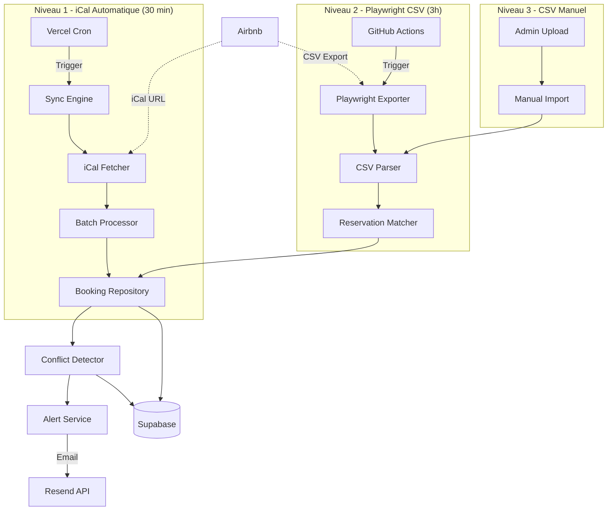
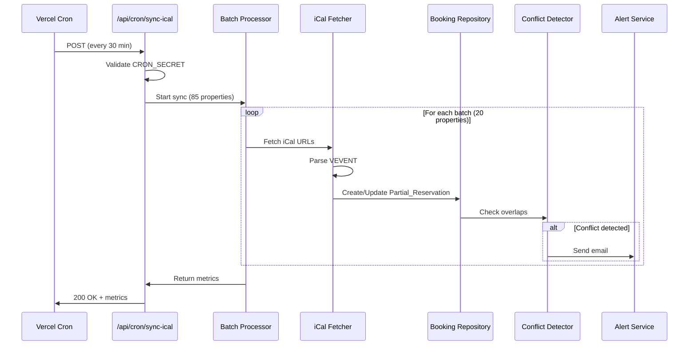
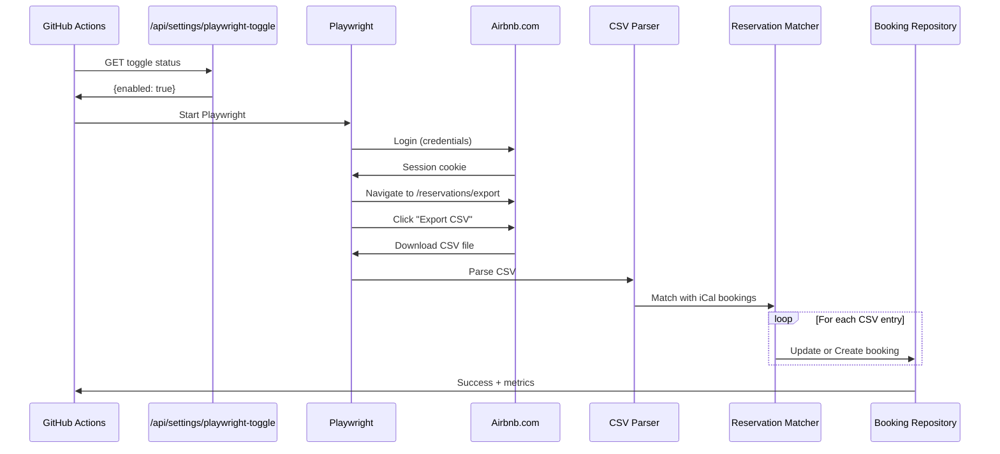

# Design Document - Système de Synchronisation Airbnb

## 1. Architecture Globale

### 1.1 Vue d'Ensemble



### 1.2 Stack Technique

- **Frontend + Backend**: Next.js 14 App Router (TypeScript)
- **Database**: Supabase PostgreSQL
- **Hosting**: Vercel (Serverless)
- **Automation**: Vercel Cron + GitHub Actions
- **Email**: Resend API
- **Scraping**: Playwright (GitHub Actions)

---

## 2. Database Schema

### 2.1 Tables Supabase

```sql
-- Table existante (lecture seule)
CREATE TABLE properties (
  id UUID PRIMARY KEY DEFAULT gen_random_uuid(),
  name TEXT NOT NULL,
  address TEXT,
  city TEXT,
  -- ... autres champs existants
  created_at TIMESTAMPTZ DEFAULT NOW(),
  updated_at TIMESTAMPTZ DEFAULT NOW()
);

-- Nouvelle table: Configuration sync
CREATE TABLE property_sync_config (
  id UUID PRIMARY KEY DEFAULT gen_random_uuid(),
  property_id UUID NOT NULL REFERENCES properties(id) ON DELETE CASCADE,
  ical_url_airbnb TEXT,
  is_active BOOLEAN DEFAULT TRUE,
  last_sync_at TIMESTAMPTZ,
  last_sync_status TEXT, -- 'success', 'error', 'partial'
  created_at TIMESTAMPTZ DEFAULT NOW(),
  updated_at TIMESTAMPTZ DEFAULT NOW(),
  UNIQUE(property_id)
);

-- Table: Réservations
CREATE TABLE bookings (
  id UUID PRIMARY KEY DEFAULT gen_random_uuid(),
  property_id UUID NOT NULL REFERENCES properties(id) ON DELETE CASCADE,
  source TEXT NOT NULL CHECK (source IN ('airbnb_ical', 'airbnb_csv', 'manual')),
  external_id TEXT, -- UID iCal ou Confirmation Code CSV
  status TEXT NOT NULL DEFAULT 'confirmed' CHECK (status IN ('confirmed', 'cancelled', 'pending', 'checked_in', 'checked_out')),
  
  -- Dates (toujours présentes)
  check_in_date DATE NOT NULL,
  check_out_date DATE NOT NULL,
  
  -- Détails clients (nullable pour Partial_Reservation)
  guest_name TEXT,
  guest_email TEXT,
  guest_phone TEXT,
  
  -- Montant (nullable pour Partial_Reservation)
  amount DECIMAL(10,2),
  currency TEXT, -- ISO 4217
  
  -- Métadonnées
  is_complete BOOLEAN DEFAULT FALSE, -- TRUE si enrichi par CSV
  csv_only_flag BOOLEAN DEFAULT FALSE, -- TRUE si créé par CSV sans match iCal
  raw_data JSONB, -- Données brutes iCal ou CSV
  
  created_at TIMESTAMPTZ DEFAULT NOW(),
  updated_at TIMESTAMPTZ DEFAULT NOW(),
  synced_at TIMESTAMPTZ DEFAULT NOW(),
  
  -- Contrainte unicité: même propriété, mêmes dates = 1 seule réservation
  UNIQUE(property_id, check_in_date, check_out_date),
  
  -- Contrainte: check-in < check-out
  CHECK (check_in_date < check_out_date)
);

-- Table: Conflits
CREATE TABLE conflicts (
  id UUID PRIMARY KEY DEFAULT gen_random_uuid(),
  property_id UUID NOT NULL REFERENCES properties(id) ON DELETE CASCADE,
  booking_id_1 UUID NOT NULL REFERENCES bookings(id) ON DELETE CASCADE,
  booking_id_2 UUID NOT NULL REFERENCES bookings(id) ON DELETE CASCADE,
  severity TEXT NOT NULL DEFAULT 'critical' CHECK (severity IN ('info', 'warning', 'critical')),
  status TEXT NOT NULL DEFAULT 'active' CHECK (status IN ('active', 'resolved', 'ignored')),
  overlap_start DATE NOT NULL,
  overlap_end DATE NOT NULL,
  details JSONB,
  created_at TIMESTAMPTZ DEFAULT NOW(),
  resolved_at TIMESTAMPTZ
);

-- Table: Logs de synchronisation
CREATE TABLE sync_logs (
  id UUID PRIMARY KEY DEFAULT gen_random_uuid(),
  sync_type TEXT NOT NULL CHECK (sync_type IN ('ical_auto', 'csv_auto', 'csv_manual', 'sync_now')),
  status TEXT NOT NULL CHECK (status IN ('success', 'error', 'partial')),
  severity TEXT DEFAULT 'info' CHECK (severity IN ('info', 'warning', 'error', 'critical')),
  
  -- Métriques
  properties_synced INTEGER DEFAULT 0,
  bookings_created INTEGER DEFAULT 0,
  bookings_updated INTEGER DEFAULT 0,
  csv_matched INTEGER DEFAULT 0,
  csv_unmatched INTEGER DEFAULT 0,
  conflicts_detected INTEGER DEFAULT 0,
  errors_count INTEGER DEFAULT 0,
  
  duration_ms INTEGER,
  error_details JSONB,
  created_at TIMESTAMPTZ DEFAULT NOW()
);

-- Table: Paramètres système
CREATE TABLE system_settings (
  id UUID PRIMARY KEY DEFAULT gen_random_uuid(),
  key TEXT NOT NULL UNIQUE,
  value TEXT NOT NULL,
  description TEXT,
  updated_by UUID, -- user_id
  created_at TIMESTAMPTZ DEFAULT NOW(),
  updated_at TIMESTAMPTZ DEFAULT NOW()
);

-- Insérer le Playwright Toggle par défaut
INSERT INTO system_settings (key, value, description)
VALUES ('playwright_toggle', 'true', 'Active/désactive le Playwright CSV export automatique');
```

### 2.2 Indexes

```sql
-- Indexes pour performance
CREATE INDEX idx_bookings_property_dates ON bookings(property_id, check_in_date, check_out_date);
CREATE INDEX idx_bookings_source ON bookings(source);
CREATE INDEX idx_bookings_status ON bookings(status);
CREATE INDEX idx_bookings_dates ON bookings(check_in_date, check_out_date);
CREATE INDEX idx_conflicts_property ON conflicts(property_id);
CREATE INDEX idx_conflicts_status ON conflicts(status);
CREATE INDEX idx_sync_logs_type_created ON sync_logs(sync_type, created_at DESC);
CREATE INDEX idx_property_sync_config_active ON property_sync_config(is_active) WHERE is_active = TRUE;
```

### 2.3 Row Level Security (RLS)

```sql
-- Activer RLS sur toutes les tables
ALTER TABLE properties ENABLE ROW LEVEL SECURITY;
ALTER TABLE property_sync_config ENABLE ROW LEVEL SECURITY;
ALTER TABLE bookings ENABLE ROW LEVEL SECURITY;
ALTER TABLE conflicts ENABLE ROW LEVEL SECURITY;
ALTER TABLE sync_logs ENABLE ROW LEVEL SECURITY;
ALTER TABLE system_settings ENABLE ROW LEVEL SECURITY;

-- Policies: Les utilisateurs authentifiés peuvent lire
CREATE POLICY "Authenticated users can read properties"
  ON properties FOR SELECT
  TO authenticated
  USING (true);

CREATE POLICY "Authenticated users can read bookings"
  ON bookings FOR SELECT
  TO authenticated
  USING (true);

-- Policies: Seuls les admins peuvent écrire
CREATE POLICY "Admins can manage sync config"
  ON property_sync_config FOR ALL
  TO authenticated
  USING (auth.jwt() ->> 'role' = 'admin');

CREATE POLICY "Admins can manage bookings"
  ON bookings FOR ALL
  TO authenticated
  USING (auth.jwt() ->> 'role' = 'admin');

-- Policies: Service accounts bypass RLS
CREATE POLICY "Service accounts bypass RLS"
  ON bookings FOR ALL
  TO service_role
  USING (true);
```

---

## 3. API Routes (Next.js App Router)

### 3.1 Structure des Routes

```
/app/api/
  cron/
    sync-ical/
      route.ts                    → POST: Sync iCal automatique (Vercel Cron)
  sync/
    trigger/
      route.ts                    → POST: Sync Now manuel
    status/
      route.ts                    → GET: État dernière sync
  bookings/
    route.ts                      → GET: Liste réservations
    [id]/
      route.ts                    → GET: Détail réservation
  properties/
    sync-config/
      route.ts                    → GET/PUT: iCal URLs
  import/
    csv/
      route.ts                    → POST: Upload CSV manuel
  export/
    csv/
      route.ts                    → GET: Export réservations
  settings/
    playwright-toggle/
      route.ts                    → GET/PUT: Playwright Toggle
```

### 3.2 Spécifications API

#### POST /api/cron/sync-ical

**Headers:**
```
Authorization: Bearer {CRON_SECRET}
```

**Response:**
```json
{
  "success": true,
  "sync_log_id": "uuid",
  "metrics": {
    "properties_synced": 85,
    "bookings_created": 12,
    "bookings_updated": 3,
    "conflicts_detected": 1,
    "duration_ms": 24500
  }
}
```

#### POST /api/sync/trigger

**Headers:**
```
Authorization: Bearer {USER_TOKEN}
```

**Response:**
```json
{
  "success": true,
  "message": "Synchronisation démarrée",
  "sync_log_id": "uuid"
}
```

#### POST /api/import/csv

**Headers:**
```
Content-Type: multipart/form-data
Authorization: Bearer {USER_TOKEN}
```

**Body:**
```
file: CSV file
```

**Response:**
```json
{
  "success": true,
  "imported": 45,
  "matched": 40,
  "created": 5,
  "errors": []
}
```

---

## 4. Composants Sync (/lib/sync/)

### 4.1 iCal Fetcher

```typescript
// lib/sync/icalFetcher.ts
import ical from 'node-ical';

export async function fetchAndParseICal(icalUrl: string) {
  const response = await fetch(icalUrl);
  const icalData = await response.text();
  const events = ical.parseICS(icalData);
  
  const reservations = [];
  for (const event of Object.values(events)) {
    if (event.type === 'VEVENT') {
      reservations.push({
        external_id: event.uid,
        check_in_date: event.start,
        check_out_date: event.end,
        summary: event.summary,
      });
    }
  }
  
  return reservations;
}
```

### 4.2 Reservation Matcher

```typescript
// lib/sync/reservationMatcher.ts

export async function matchCSVWithICal(
  csvEntry: CSVEntry,
  existingBookings: Booking[]
): Promise<MatchResult> {
  // 1. Exact match
  const exactMatch = existingBookings.find(b =>
    b.property_id === csvEntry.property_id &&
    b.check_in_date === csvEntry.check_in &&
    b.check_out_date === csvEntry.check_out
  );
  
  if (exactMatch) {
    return { type: 'exact', booking: exactMatch };
  }
  
  // 2. Fuzzy match (±1 jour)
  const fuzzyMatch = existingBookings.find(b =>
    b.property_id === csvEntry.property_id &&
    Math.abs(daysDiff(b.check_in_date, csvEntry.check_in)) <= 1 &&
    Math.abs(daysDiff(b.check_out_date, csvEntry.check_out)) <= 1
  );
  
  if (fuzzyMatch) {
    return { type: 'fuzzy', booking: fuzzyMatch };
  }
  
  // 3. No match
  return { type: 'no_match', booking: null };
}
```

### 4.3 Conflict Detector

```typescript
// lib/sync/conflictDetector.ts

export async function detectConflicts(
  newBooking: Booking,
  existingBookings: Booking[]
): Promise<Conflict[]> {
  const conflicts = [];
  
  for (const existing of existingBookings) {
    // Skip si même réservation
    if (existing.id === newBooking.id) continue;
    
    // Skip si pas confirmée
    if (!['confirmed', 'checked_in'].includes(existing.status)) continue;
    
    // Détection chevauchement
    const overlaps = (
      newBooking.check_in_date < existing.check_out_date &&
      newBooking.check_out_date > existing.check_in_date
    );
    
    if (overlaps) {
      conflicts.push({
        booking_id_1: newBooking.id,
        booking_id_2: existing.id,
        property_id: newBooking.property_id,
        severity: 'critical',
        overlap_start: Math.max(newBooking.check_in_date, existing.check_in_date),
        overlap_end: Math.min(newBooking.check_out_date, existing.check_out_date),
      });
    }
  }
  
  return conflicts;
}
```

---

## 5. Sequence Diagrams

### 5.1 Sync iCal Automatique (30 min)



### 5.2 Playwright CSV Export (3h)



---

## 6. Configuration Files

### 6.1 vercel.json

```json
{
  "crons": [
    {
      "path": "/api/cron/sync-ical",
      "schedule": "*/30 * * * *"
    }
  ]
}
```

### 6.2 GitHub Actions Workflow

```yaml
# .github/workflows/airbnb-csv-export.yml
name: Airbnb CSV Export

on:
  schedule:
    - cron: '0 3 * * *'  # 3h UTC tous les jours
  workflow_dispatch:  # Manuel trigger

jobs:
  export-csv:
    runs-on: ubuntu-latest
    
    steps:
      - name: Checkout
        uses: actions/checkout@v4
      
      - name: Setup Node.js
        uses: actions/setup-node@v4
        with:
          node-version: '20'
      
      - name: Install Playwright
        run: |
          npm install playwright
          npx playwright install chromium
      
      - name: Check Playwright Toggle
        id: check-toggle
        run: |
          TOGGLE=$(curl -H "Authorization: Bearer ${{ secrets.API_SECRET }}" \
            https://www.loftalgerie.com/api/settings/playwright-toggle)
          echo "enabled=$(echo $TOGGLE | jq -r '.enabled')" >> $GITHUB_OUTPUT
      
      - name: Run Playwright Export
        if: steps.check-toggle.outputs.enabled == 'true'
        env:
          AIRBNB_EMAIL: ${{ secrets.AIRBNB_EMAIL }}
          AIRBNB_PASSWORD: ${{ secrets.AIRBNB_PASSWORD }}
          SUPABASE_URL: ${{ secrets.SUPABASE_URL }}
          SUPABASE_SERVICE_ROLE_KEY: ${{ secrets.SUPABASE_SERVICE_ROLE_KEY }}
        run: node scripts/airbnbExport.js
```

---

## 7. Performance & Scalabilité

### 7.1 Batch Processing

- **85 propriétés** divisées en **5 batches de 17 propriétés**
- Chaque batch: **< 25 secondes** (safety margin 5s)
- Total: **~2 minutes** pour sync complète

### 7.2 Rate Limiting

- **iCal**: Max 100 requêtes/minute
- **Playwright**: Délais aléatoires 5-15s entre actions
- **Resend Email**: Max 10 emails/minute

### 7.3 Indexes Database

- Tous les indexes créés sur colonnes fréquemment requêtées
- Query time: **< 100ms** pour 10,000 réservations

---

## 8. Sécurité

### 8.1 Authentification

- **Cron routes**: Secret token dans header
- **Admin routes**: JWT token Supabase
- **GitHub Actions**: API secret token

### 8.2 RLS Supabase

- Utilisateurs: Lecture seule
- Admins: CRUD complet
- Service accounts: Bypass RLS

### 8.3 Credentials

- **GitHub Secrets**: AIRBNB_EMAIL, AIRBNB_PASSWORD
- **Vercel Env**: CRON_SECRET, RESEND_API_KEY
- **Supabase Env**: SERVICE_ROLE_KEY

---

## 9. Monitoring & Alertes

### 9.1 Métriques Trackées

- Properties synced
- Bookings created/updated
- CSV matched/unmatched
- Conflicts detected
- Errors count
- Duration (ms)

### 9.2 Alertes Email

- **Conflits critiques**: Immédiat
- **Playwright échec 3 jours**: Quotidien
- **Credentials invalides**: Immédiat

---

## 10. Error Handling

### 10.1 Retry Logic

- **iCal fetch**: 3 retries, backoff 2s/4s/8s
- **Playwright auth**: 3 retries
- **Resend email**: 3 retries, backoff 1s/2s/4s

### 10.2 Rollback

- Transaction SQL pour chaque batch
- Rollback si erreur dans le batch
- Continue avec batch suivant

---

## 11. Cas Limites

- **CSV vide**: Log warning, ne supprime pas les réservations existantes
- **iCal 404**: Log error, continue avec autres propriétés
- **Doublon détecté**: Skip, log "duplicate_skipped"
- **CAPTCHA Playwright**: Pause, envoie alerte admin
