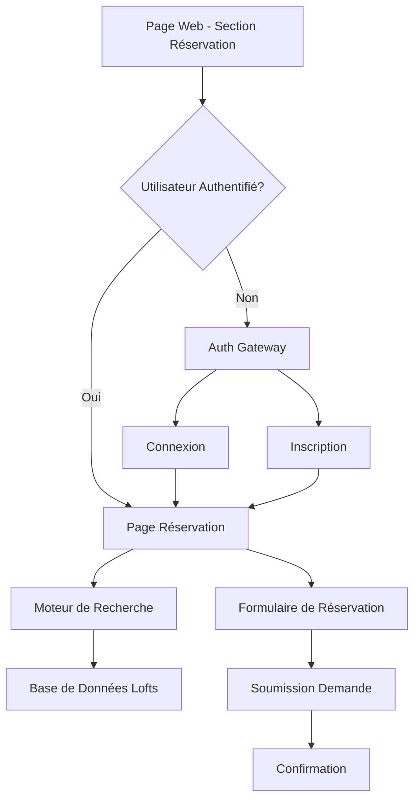
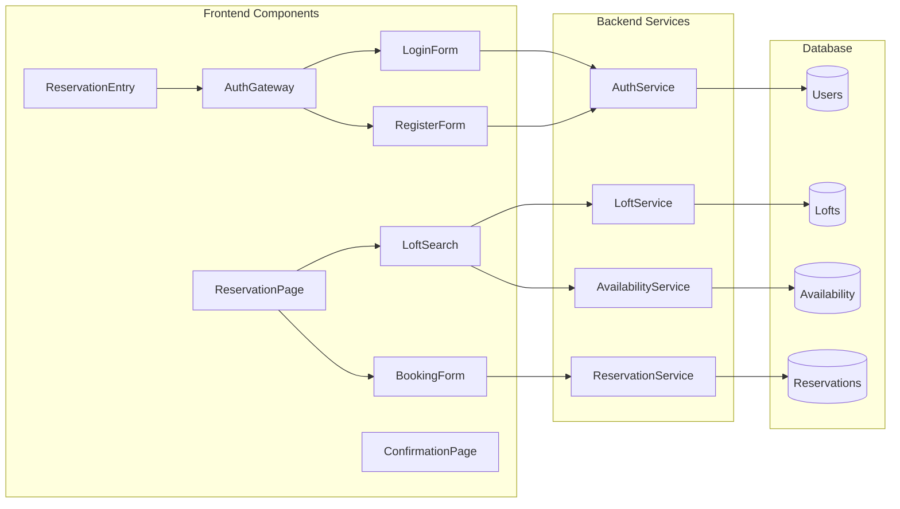

# Design Document - Client Reservation Flow

## Overview

Le flux de réservation client est conçu comme un système intégré qui guide les utilisateurs depuis l'accès initial jusqu'à la soumission de leur demande de réservation. L'architecture privilégie une expérience utilisateur fluide avec authentification transparente et accès aux données réelles de la base de données.

## Architecture

### High-Level Architecture



### Component Architecture



## Components and Interfaces

### 1. ReservationEntry Component
**Responsabilité**: Point d'entrée depuis la page web vers le flux de réservation

**Interface**:
```typescript
interface ReservationEntryProps {
  onAuthRequired: () => void;
  onAuthSuccess: (user: User) => void;
}

interface ReservationEntryState {
  isAuthenticated: boolean;
  user: User | null;
  loading: boolean;
}
```

**Fonctionnalités**:
- Détection du statut d'authentification
- Redirection vers AuthGateway si nécessaire
- Redirection vers ReservationPage si authentifié

### 2. AuthGateway Component
**Responsabilité**: Gestion de l'authentification avec options de connexion/inscription

**Interface**:
```typescript
interface AuthGatewayProps {
  returnUrl: string;
  onAuthSuccess: (user: User) => void;
}

interface AuthGatewayState {
  mode: 'login' | 'register';
  loading: boolean;
  error: string | null;
}
```

**Fonctionnalités**:
- Affichage des options connexion/inscription
- Gestion des formulaires d'authentification
- Redirection après authentification réussie

### 3. ReservationPage Component
**Responsabilité**: Page principale de réservation avec recherche et sélection

**Interface**:
```typescript
interface ReservationPageProps {
  user: User;
}

interface ReservationPageState {
  searchCriteria: SearchCriteria;
  availableLofts: Loft[];
  selectedLoft: Loft | null;
  selectedDates: DateRange | null;
  loading: boolean;
}

interface SearchCriteria {
  checkIn: Date;
  checkOut: Date;
  guests: number;
  location?: string;
  priceRange?: [number, number];
}
```

### 4. LoftSearch Component
**Responsabilité**: Interface de recherche et affichage des résultats

**Interface**:
```typescript
interface LoftSearchProps {
  onLoftSelect: (loft: Loft) => void;
  onCriteriaChange: (criteria: SearchCriteria) => void;
}

interface LoftSearchState {
  criteria: SearchCriteria;
  results: Loft[];
  loading: boolean;
  sortBy: 'price' | 'rating' | 'distance';
}
```

### 5. BookingForm Component
**Responsabilité**: Formulaire de réservation avec calcul des prix

**Interface**:
```typescript
interface BookingFormProps {
  loft: Loft;
  dates: DateRange;
  user: User;
  onSubmit: (reservation: ReservationRequest) => void;
}

interface BookingFormState {
  guestInfo: GuestInfo;
  specialRequests: string;
  pricing: PricingBreakdown;
  termsAccepted: boolean;
}

interface PricingBreakdown {
  nightlyRate: number;
  nights: number;
  subtotal: number;
  cleaningFee: number;
  taxes: number;
  total: number;
}
```

## Data Models

### User Model
```typescript
interface User {
  id: string;
  email: string;
  firstName: string;
  lastName: string;
  phone: string;
  preferences: UserPreferences;
  createdAt: Date;
  updatedAt: Date;
}

interface UserPreferences {
  language: string;
  currency: string;
  notifications: NotificationSettings;
}
```

### Loft Model
```typescript
interface Loft {
  id: string;
  name: string;
  description: string;
  location: Location;
  amenities: string[];
  photos: Photo[];
  pricing: LoftPricing;
  availability: AvailabilityRule[];
  policies: LoftPolicies;
  rating: number;
  reviewCount: number;
}

interface Location {
  address: string;
  city: string;
  coordinates: [number, number];
}

interface LoftPricing {
  baseRate: number;
  cleaningFee: number;
  taxRate: number;
  seasonalRates?: SeasonalRate[];
}
```

### Reservation Model
```typescript
interface ReservationRequest {
  id: string;
  userId: string;
  loftId: string;
  checkIn: Date;
  checkOut: Date;
  guests: number;
  guestInfo: GuestInfo;
  pricing: PricingBreakdown;
  specialRequests?: string;
  status: 'pending' | 'confirmed' | 'cancelled';
  createdAt: Date;
}

interface GuestInfo {
  primaryGuest: {
    firstName: string;
    lastName: string;
    email: string;
    phone: string;
  };
  additionalGuests?: Guest[];
}
```

## Backend Services

### AuthService
**Responsabilité**: Gestion de l'authentification et des comptes utilisateurs

**Méthodes principales**:
```typescript
class AuthService {
  async login(email: string, password: string): Promise<User>;
  async register(userData: RegisterData): Promise<User>;
  async getCurrentUser(): Promise<User | null>;
  async updateProfile(userId: string, updates: Partial<User>): Promise<User>;
}
```

### LoftService
**Responsabilité**: Gestion des données de lofts

**Méthodes principales**:
```typescript
class LoftService {
  async searchLofts(criteria: SearchCriteria): Promise<Loft[]>;
  async getLoftById(id: string): Promise<Loft>;
  async getLoftPhotos(loftId: string): Promise<Photo[]>;
  async getLoftReviews(loftId: string): Promise<Review[]>;
}
```

### AvailabilityService
**Responsabilité**: Gestion des disponibilités et prix en temps réel

**Méthodes principales**:
```typescript
class AvailabilityService {
  async checkAvailability(loftId: string, dates: DateRange): Promise<boolean>;
  async calculatePricing(loftId: string, dates: DateRange): Promise<PricingBreakdown>;
  async lockReservation(loftId: string, dates: DateRange): Promise<string>;
  async releaseReservationLock(lockId: string): Promise<void>;
}
```

### ReservationService
**Responsabilité**: Gestion des demandes de réservation

**Méthodes principales**:
```typescript
class ReservationService {
  async createReservation(request: ReservationRequest): Promise<Reservation>;
  async getUserReservations(userId: string): Promise<Reservation[]>;
  async updateReservation(id: string, updates: Partial<Reservation>): Promise<Reservation>;
  async cancelReservation(id: string): Promise<void>;
}
```

## Database Schema

### Tables principales

**users**
- id (UUID, PK)
- email (VARCHAR, UNIQUE)
- password_hash (VARCHAR)
- first_name (VARCHAR)
- last_name (VARCHAR)
- phone (VARCHAR)
- preferences (JSONB)
- created_at (TIMESTAMP)
- updated_at (TIMESTAMP)

**lofts**
- id (UUID, PK)
- name (VARCHAR)
- description (TEXT)
- location (JSONB)
- amenities (TEXT[])
- base_rate (DECIMAL)
- cleaning_fee (DECIMAL)
- tax_rate (DECIMAL)
- policies (JSONB)
- rating (DECIMAL)
- review_count (INTEGER)
- created_at (TIMESTAMP)

**loft_photos**
- id (UUID, PK)
- loft_id (UUID, FK)
- url (VARCHAR)
- alt_text (VARCHAR)
- order_index (INTEGER)

**reservations**
- id (UUID, PK)
- user_id (UUID, FK)
- loft_id (UUID, FK)
- check_in (DATE)
- check_out (DATE)
- guests (INTEGER)
- guest_info (JSONB)
- pricing (JSONB)
- special_requests (TEXT)
- status (VARCHAR)
- created_at (TIMESTAMP)

**availability**
- id (UUID, PK)
- loft_id (UUID, FK)
- date (DATE)
- available (BOOLEAN)
- price_override (DECIMAL)
- minimum_stay (INTEGER)

## Error Handling

### Frontend Error Handling
```typescript
interface ErrorState {
  type: 'auth' | 'network' | 'validation' | 'availability';
  message: string;
  details?: any;
  recoverable: boolean;
}

class ErrorHandler {
  static handleAuthError(error: AuthError): void;
  static handleNetworkError(error: NetworkError): void;
  static handleValidationError(error: ValidationError): void;
  static handleAvailabilityError(error: AvailabilityError): void;
}
```

### Backend Error Handling
```typescript
class ReservationError extends Error {
  constructor(
    message: string,
    public code: string,
    public statusCode: number,
    public details?: any
  ) {
    super(message);
  }
}

// Types d'erreurs spécifiques
class LoftNotAvailableError extends ReservationError;
class InvalidDatesError extends ReservationError;
class PricingError extends ReservationError;
class AuthenticationError extends ReservationError;
```

## Security Considerations

### Authentication Security
- Utilisation de JWT tokens avec expiration
- Hachage sécurisé des mots de passe (bcrypt)
- Protection CSRF pour les formulaires
- Validation côté serveur de toutes les entrées

### Data Protection
- Chiffrement des données sensibles en base
- Validation et sanitisation des entrées utilisateur
- Protection contre l'injection SQL
- Audit trail des actions utilisateur

### API Security
- Rate limiting sur les endpoints d'authentification
- Validation des permissions pour chaque requête
- Logs de sécurité pour les actions sensibles
- Protection contre les attaques de force brute

## Performance Optimization

### Frontend Optimization
- Lazy loading des composants de réservation
- Cache des résultats de recherche
- Optimisation des images de lofts
- Debouncing des requêtes de recherche

### Backend Optimization
- Index sur les colonnes de recherche fréquente
- Cache Redis pour les données de disponibilité
- Pagination des résultats de recherche
- Optimisation des requêtes de base de données

### Database Optimization
```sql
-- Index pour les recherches de disponibilité
CREATE INDEX idx_availability_loft_date ON availability(loft_id, date);

-- Index pour les recherches de lofts par localisation
CREATE INDEX idx_lofts_location ON lofts USING GIN(location);

-- Index pour les réservations par utilisateur
CREATE INDEX idx_reservations_user_status ON reservations(user_id, status);
```

## Testing Strategy

### Unit Tests
- Tests des composants React avec Jest/React Testing Library
- Tests des services backend avec mocks de base de données
- Tests des utilitaires de validation et calcul de prix
- Couverture de code minimum de 80%

### Integration Tests
- Tests du flux complet d'authentification
- Tests de l'intégration base de données
- Tests des API endpoints avec données réelles
- Tests de la logique de disponibilité

### End-to-End Tests
- Tests du parcours utilisateur complet avec Playwright
- Tests sur différents navigateurs et tailles d'écran
- Tests de performance et de charge
- Tests d'accessibilité

### Test Data Management
```typescript
// Factory pour les données de test
class TestDataFactory {
  static createUser(overrides?: Partial<User>): User;
  static createLoft(overrides?: Partial<Loft>): Loft;
  static createReservation(overrides?: Partial<Reservation>): Reservation;
}

// Utilitaires de nettoyage
class TestCleanup {
  static async cleanupTestUsers(): Promise<void>;
  static async cleanupTestReservations(): Promise<void>;
  static async resetTestDatabase(): Promise<void>;
}
```