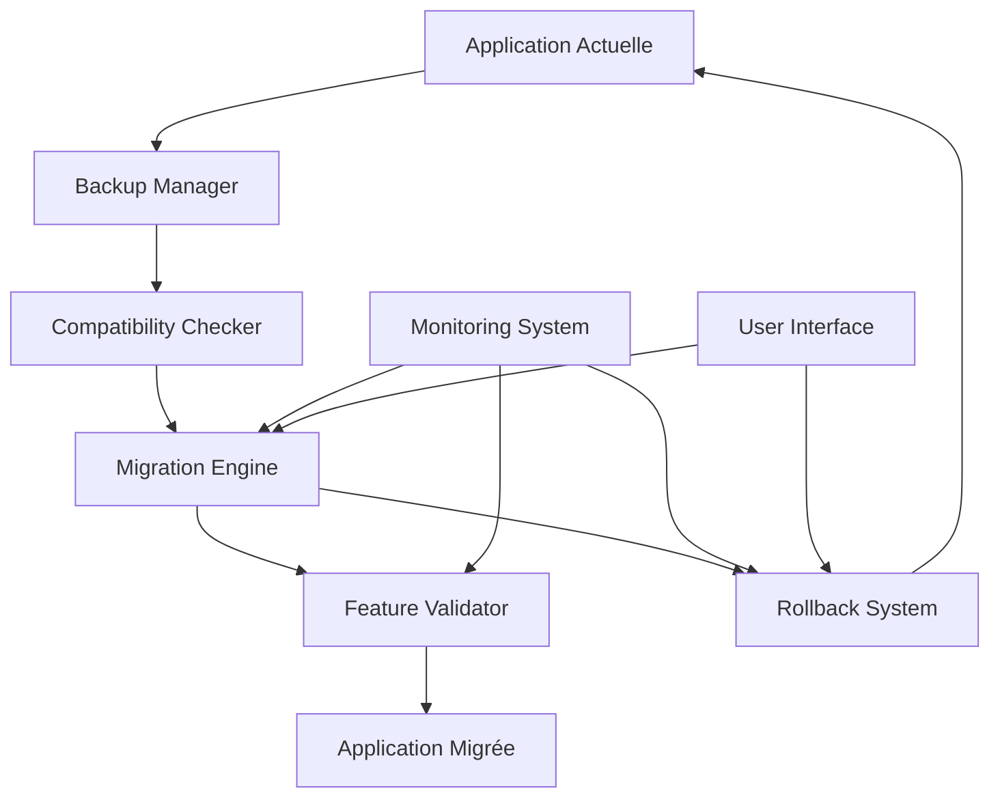
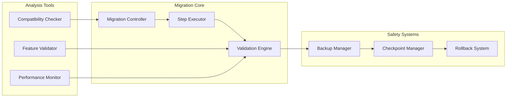

# Design Document - Migration Next.js 16 Sécurisée

## Overview

Cette migration Next.js 16 suit une approche **"Safety-First"** avec validation continue et rollback automatique. Le système est conçu pour préserver intégralement l'application existante tout en bénéficiant des améliorations de Next.js 16.

L'architecture de migration repose sur trois piliers :
1. **Sauvegarde Intelligente** : Snapshots automatiques à chaque étape
2. **Validation Continue** : Tests automatisés après chaque modification
3. **Rollback Instantané** : Retour automatique en cas de problème

## Architecture

### Vue d'ensemble du système de migration



### Architecture des composants



## Components and Interfaces

### 1. Migration Controller

**Responsabilité** : Orchestration générale de la migration

```typescript
interface MigrationController {
  // Configuration et planification
  analyzeCurrent(): ApplicationAnalysis
  planMigration(): MigrationPlan
  
  // Exécution contrôlée
  executeMigration(plan: MigrationPlan): Promise<MigrationResult>
  pauseMigration(): void
  resumeMigration(): void
  
  // Monitoring
  getStatus(): MigrationStatus
  getProgress(): MigrationProgress
}

interface ApplicationAnalysis {
  nextjsVersion: string
  dependencies: DependencyInfo[]
  customConfigurations: ConfigInfo[]
  criticalFeatures: FeatureInfo[]
  testCoverage: CoverageInfo
  performanceBaseline: PerformanceMetrics
}
```

### 2. Backup Manager

**Responsabilité** : Gestion des sauvegardes et snapshots

```typescript
interface BackupManager {
  // Création de sauvegardes
  createFullBackup(): Promise<BackupInfo>
  createIncrementalBackup(): Promise<BackupInfo>
  
  // Validation des sauvegardes
  validateBackup(backupId: string): Promise<ValidationResult>
  
  // Gestion des snapshots
  createSnapshot(label: string): Promise<SnapshotInfo>
  listSnapshots(): SnapshotInfo[]
  
  // Restauration
  restoreFromBackup(backupId: string): Promise<RestoreResult>
  restoreFromSnapshot(snapshotId: string): Promise<RestoreResult>
}

interface BackupInfo {
  id: string
  timestamp: Date
  type: 'full' | 'incremental'
  size: number
  checksum: string
  includedFiles: string[]
  databaseSchema: boolean
  environmentVariables: boolean
}
```

### 3. Compatibility Checker

**Responsabilité** : Analyse de compatibilité des dépendances

```typescript
interface CompatibilityChecker {
  // Analyse des dépendances
  analyzeDependencies(): Promise<DependencyAnalysis>
  checkNextjs16Compatibility(): Promise<CompatibilityReport>
  
  // Recommandations d'upgrade
  getUpgradePath(): UpgradePath[]
  validateUpgradePath(path: UpgradePath): Promise<ValidationResult>
  
  // Tests de compatibilité
  testPackageCompatibility(packageName: string, version: string): Promise<CompatibilityResult>
}

interface DependencyAnalysis {
  totalPackages: number
  compatiblePackages: PackageInfo[]
  incompatiblePackages: PackageInfo[]
  unknownPackages: PackageInfo[]
  recommendedUpgrades: UpgradeRecommendation[]
}
```

### 4. Step Executor

**Responsabilité** : Exécution des étapes de migration

```typescript
interface StepExecutor {
  // Exécution d'étapes
  executeStep(step: MigrationStep): Promise<StepResult>
  
  // Validation d'étapes
  validateStep(step: MigrationStep): Promise<ValidationResult>
  
  // Rollback d'étapes
  rollbackStep(step: MigrationStep): Promise<RollbackResult>
}

interface MigrationStep {
  id: string
  name: string
  description: string
  type: 'dependency' | 'configuration' | 'code' | 'test'
  dependencies: string[] // IDs des étapes prérequises
  rollbackable: boolean
  estimatedDuration: number
  riskLevel: 'low' | 'medium' | 'high'
  validationCriteria: ValidationCriteria[]
}
```

### 5. Feature Validator

**Responsabilité** : Validation des fonctionnalités après migration

```typescript
interface FeatureValidator {
  // Validation complète
  validateAllFeatures(): Promise<ValidationReport>
  
  // Validation spécifique
  validateAuthentication(): Promise<FeatureValidationResult>
  validateI18n(): Promise<FeatureValidationResult>
  validateDatabase(): Promise<FeatureValidationResult>
  validatePayments(): Promise<FeatureValidationResult>
  validateReports(): Promise<FeatureValidationResult>
  
  // Tests de régression
  runRegressionTests(): Promise<RegressionTestResult>
  
  // Validation de performance
  validatePerformance(): Promise<PerformanceValidationResult>
}

interface ValidationReport {
  overallStatus: 'success' | 'warning' | 'failure'
  featureResults: FeatureValidationResult[]
  regressionResults: RegressionTestResult
  performanceResults: PerformanceValidationResult
  recommendations: string[]
}
```

## Data Models

### Migration Plan

```typescript
interface MigrationPlan {
  id: string
  createdAt: Date
  estimatedDuration: number
  totalSteps: number
  
  phases: MigrationPhase[]
  rollbackPlan: RollbackPlan
  validationStrategy: ValidationStrategy
}

interface MigrationPhase {
  id: string
  name: string
  description: string
  steps: MigrationStep[]
  checkpoints: Checkpoint[]
  rollbackStrategy: PhaseRollbackStrategy
}
```

### Validation Strategy

```typescript
interface ValidationStrategy {
  // Tests automatiques
  runUnitTests: boolean
  runIntegrationTests: boolean
  runE2ETests: boolean
  
  // Validation fonctionnelle
  validateCriticalPaths: boolean
  validatePerformance: boolean
  validateSecurity: boolean
  
  // Seuils d'acceptation
  maxPerformanceDegradation: number // pourcentage
  minTestCoverage: number // pourcentage
  maxErrorRate: number // pourcentage
}
```

### Rollback Plan

```typescript
interface RollbackPlan {
  automaticTriggers: RollbackTrigger[]
  manualTriggers: string[]
  rollbackSteps: RollbackStep[]
  estimatedRollbackTime: number
}

interface RollbackTrigger {
  condition: string
  threshold: number
  action: 'pause' | 'rollback' | 'notify'
}
```

## Correctness Properties

*A property is a characteristic or behavior that should hold true across all valid executions of a system-essentially, a formal statement about what the system should do. Properties serve as the bridge between human-readable specifications and machine-verifiable correctness guarantees.*

### Property Reflection

Après analyse du prework, plusieurs propriétés peuvent être consolidées :
- Les propriétés de préservation des fonctionnalités (1.1-1.6) peuvent être regroupées en une propriété générale de préservation fonctionnelle
- Les propriétés de sauvegarde (2.1-2.5) forment un ensemble cohérent de propriétés de sécurité des données
- Les propriétés de compatibilité (3.1-3.5) peuvent être consolidées en propriétés d'analyse et de résolution de dépendances
- Les propriétés de validation (6.1-6.5, 8.1-8.5) peuvent être regroupées par type de validation

### Property 1: Functional Preservation
*For any* critical business function in the original application, after migration completion, that function should produce identical results when given the same inputs
**Validates: Requirements 1.1, 1.2, 1.3, 1.4, 1.5, 1.6**

### Property 2: Backup Completeness and Integrity
*For any* backup created during migration, restoring from that backup should result in a fully functional application state identical to the state when the backup was created
**Validates: Requirements 2.1, 2.2, 2.3, 2.5**

### Property 3: Rollback Time Guarantee
*For any* rollback operation triggered during migration, the system should restore to the previous stable state within the specified time limit (2-5 minutes depending on operation type)
**Validates: Requirements 2.4, 8.5**

### Property 4: Dependency Compatibility Resolution
*For any* package dependency in the application, the compatibility checker should either confirm Next.js 16 compatibility or provide a valid upgrade path that maintains functionality
**Validates: Requirements 3.1, 3.2, 3.3, 3.4, 3.5**

### Property 5: Internationalization Preservation
*For any* page or component in the application, after migration, it should display correct translations and maintain proper RTL/LTR behavior for all supported languages (fr/en/ar)
**Validates: Requirements 4.1, 4.2, 4.3, 4.4, 4.5**

### Property 6: Database Integration Continuity
*For any* database operation (query, mutation, file upload) that worked before migration, the same operation should work identically after migration with preserved security policies
**Validates: Requirements 5.1, 5.2, 5.3, 5.4, 5.5**

### Property 7: Test Suite Preservation
*For any* existing test (unit, integration, E2E) that passed before migration, the same test should pass after migration with maintained or improved performance
**Validates: Requirements 6.1, 6.2, 6.3, 6.4, 6.5**

### Property 8: Deployment Configuration Preservation
*For any* deployment environment (dev/test/prod), all configuration settings, environment variables, and optimization settings should be preserved and functional after migration
**Validates: Requirements 7.1, 7.2, 7.3, 7.4, 7.5**

### Property 9: Migration Step Validation
*For any* migration step executed, the system should create a checkpoint, validate functionality, and be capable of rollback before proceeding to the next step
**Validates: Requirements 8.1, 8.2, 8.3, 8.4**

### Property 10: Migration Documentation Completeness
*For any* change made during migration, the system should log the change with timestamp, rationale, and impact assessment, culminating in a comprehensive migration report
**Validates: Requirements 9.1, 9.2, 9.3, 9.4, 9.5**

## Error Handling

### Stratégie de gestion d'erreurs en cascade

```typescript
enum ErrorSeverity {
  INFO = 'info',
  WARNING = 'warning', 
  ERROR = 'error',
  CRITICAL = 'critical'
}

interface ErrorHandler {
  handleError(error: MigrationError): ErrorResponse
  escalateError(error: MigrationError): void
  recoverFromError(error: MigrationError): Promise<RecoveryResult>
}

interface MigrationError {
  id: string
  timestamp: Date
  severity: ErrorSeverity
  phase: string
  step: string
  message: string
  stackTrace: string
  context: Record<string, any>
  rollbackRequired: boolean
}
```

### Actions automatiques par niveau d'erreur

- **INFO** : Logging uniquement, continuation
- **WARNING** : Logging + notification, continuation avec surveillance
- **ERROR** : Pause de la migration, demande d'intervention utilisateur
- **CRITICAL** : Rollback automatique immédiat

### Stratégies de récupération

1. **Retry avec backoff** : Pour les erreurs temporaires
2. **Skip avec warning** : Pour les étapes optionnelles
3. **Alternative path** : Pour les étapes avec solutions de contournement
4. **Manual intervention** : Pour les erreurs complexes
5. **Automatic rollback** : Pour les erreurs critiques

## Testing Strategy

### Approche de test dual

La stratégie de test combine **tests unitaires** et **tests basés sur les propriétés** pour une couverture complète :

- **Tests unitaires** : Validation d'exemples spécifiques, cas limites, et conditions d'erreur
- **Tests de propriétés** : Validation des propriétés universelles sur tous les inputs possibles

### Configuration des tests de propriétés

- **Minimum 100 itérations** par test de propriété (en raison de la randomisation)
- **Tag de référence** : **Feature: nextjs-16-migration-plan, Property {number}: {property_text}**
- **Framework** : fast-check pour TypeScript/JavaScript
- **Générateurs intelligents** : Contraints à l'espace d'input pertinent

### Tests unitaires ciblés

Les tests unitaires se concentrent sur :
- **Exemples spécifiques** démontrant le comportement correct
- **Points d'intégration** entre composants
- **Cas limites et conditions d'erreur**
- **Scénarios de rollback**

### Validation continue

```typescript
interface ContinuousValidation {
  // Tests automatiques après chaque étape
  runPostStepValidation(step: MigrationStep): Promise<ValidationResult>
  
  // Tests de régression complets
  runFullRegressionSuite(): Promise<RegressionResult>
  
  // Tests de performance
  runPerformanceBenchmarks(): Promise<PerformanceResult>
  
  // Tests de sécurité
  runSecurityValidation(): Promise<SecurityResult>
}
```

### Métriques de succès

- **Couverture de test** : Maintien du niveau actuel (minimum 80%)
- **Performance** : Aucune dégradation > 10%
- **Fonctionnalité** : 100% des fonctionnalités critiques préservées
- **Temps de rollback** : < 5 minutes pour rollback complet
- **Temps de migration** : < 2 heures pour migration complète