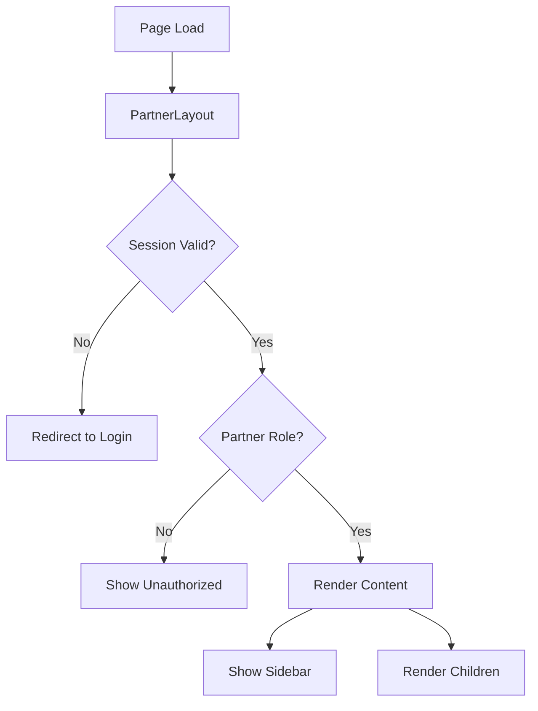

# Partner Dashboard Component Documentation

## Overview

This document provides comprehensive documentation for the improved Partner Dashboard components, including API references, usage examples, and best practices.

## Table of Contents

1. [PartnerSidebar Component](#partnersidebar-component)
2. [PartnerLayout Component](#partnerlayout-component)
3. [Translation Key Structure](#translation-key-structure)
4. [Common Patterns](#common-patterns)

---

## PartnerSidebar Component

### Description

The `PartnerSidebar` component provides a fully internationalized navigation sidebar for the partner dashboard. It includes navigation items, user profile display, and responsive mobile support.

### Location

`components/partner/PartnerSidebar.tsx`

### Props

```typescript
interface PartnerSidebarProps {
  locale: string;              // Current locale (fr, en, ar)
  currentPath?: string;        // Current page path for active state
  userProfile?: {              // User profile information
    name: string;
    email: string;
    avatar?: string;
  };
}
```

### API Reference

#### Props Details

| Prop | Type | Required | Default | Description |
|------|------|----------|---------|-------------|
| `locale` | `string` | Yes | - | The current locale for translations (fr, en, ar) |
| `currentPath` | `string` | No | `undefined` | Current page path to highlight active navigation item |
| `userProfile` | `UserProfile` | No | `undefined` | User information to display in sidebar footer |
| `userProfile.name` | `string` | No | - | User's display name |
| `userProfile.email` | `string` | No | - | User's email address |
| `userProfile.avatar` | `string` | No | - | URL to user's avatar image |

### Usage Examples

#### Basic Usage

```tsx
import { PartnerSidebar } from '@/components/partner/PartnerSidebar';

export default function PartnerPage({ params }: { params: { locale: string } }) {
  return (
    <div className="flex min-h-screen">
      <PartnerSidebar locale={params.locale} />
      <main className="flex-1">
        {/* Page content */}
      </main>
    </div>
  );
}
```

#### With User Profile

```tsx
import { PartnerSidebar } from '@/components/partner/PartnerSidebar';
import { getSession } from '@/lib/auth';

export default async function PartnerPage({ params }: { params: { locale: string } }) {
  const session = await getSession();
  
  return (
    <div className="flex min-h-screen">
      <PartnerSidebar 
        locale={params.locale}
        userProfile={{
          name: session.user.full_name || session.user.email,
          email: session.user.email,
          avatar: session.user.avatar_url,
        }}
      />
      <main className="flex-1">
        {/* Page content */}
      </main>
    </div>
  );
}
```

#### With Active State

```tsx
'use client';

import { PartnerSidebar } from '@/components/partner/PartnerSidebar';
import { usePathname } from 'next/navigation';

export function PartnerDashboardLayout({ 
  locale, 
  children 
}: { 
  locale: string; 
  children: React.ReactNode;
}) {
  const pathname = usePathname();
  
  return (
    <div className="flex min-h-screen">
      <PartnerSidebar 
        locale={locale}
        currentPath={pathname}
      />
      <main className="flex-1">
        {children}
      </main>
    </div>
  );
}
```

### Navigation Items

The sidebar includes the following navigation items:

| Item | Translation Key | Icon | Route |
|------|----------------|------|-------|
| Dashboard | `partner.navigation.dashboard` | LayoutDashboard | `/{locale}/partner/dashboard` |
| Properties | `partner.navigation.properties` | Building2 | `/{locale}/partner/properties` |
| Bookings | `partner.navigation.bookings` | Calendar | `/{locale}/partner/bookings` |
| Revenue | `partner.navigation.revenue` | DollarSign | `/{locale}/partner/revenue` |
| Analytics | `partner.navigation.analytics` | BarChart3 | `/{locale}/partner/analytics` |
| Messages | `partner.navigation.messages` | MessageSquare | `/{locale}/partner/messages` |
| Settings | `partner.navigation.settings` | Settings | `/{locale}/partner/settings` |

### Features

- **Internationalization**: Fully translated using next-intl
- **Active State**: Automatically highlights current page
- **Responsive**: Collapses to mobile menu on small screens
- **User Profile**: Displays user info with dropdown menu
- **Logout**: Integrated logout functionality in user dropdown

### Styling

The component uses shadcn/ui Sidebar components with Tailwind CSS classes. It supports:
- Light/dark mode
- RTL layout for Arabic
- Responsive breakpoints
- Smooth transitions

---

## PartnerLayout Component

### Description

The `PartnerLayout` component is a wrapper that provides consistent layout structure for all partner dashboard pages. It includes the sidebar, authentication checks, and session management.

### Location

`components/partner/PartnerLayout.tsx`

### Props

```typescript
interface PartnerLayoutProps {
  children: React.ReactNode;   // Page content to render
  locale: string;              // Current locale (fr, en, ar)
  showSidebar?: boolean;       // Whether to show sidebar
}
```

### API Reference

#### Props Details

| Prop | Type | Required | Default | Description |
|------|------|----------|---------|-------------|
| `children` | `React.ReactNode` | Yes | - | The page content to render inside the layout |
| `locale` | `string` | Yes | - | The current locale for translations (fr, en, ar) |
| `showSidebar` | `boolean` | No | `true` | Whether to display the sidebar |

### Usage Examples

#### Basic Usage

```tsx
import { PartnerLayout } from '@/components/partner/PartnerLayout';

export default function PartnerDashboardPage({ 
  params 
}: { 
  params: { locale: string } 
}) {
  return (
    <PartnerLayout locale={params.locale}>
      <div className="container mx-auto p-6">
        <h1>Dashboard Content</h1>
        {/* Your dashboard content */}
      </div>
    </PartnerLayout>
  );
}
```

#### Without Sidebar

```tsx
import { PartnerLayout } from '@/components/partner/PartnerLayout';

export default function PartnerFullscreenPage({ 
  params 
}: { 
  params: { locale: string } 
}) {
  return (
    <PartnerLayout locale={params.locale} showSidebar={false}>
      <div className="w-full h-screen">
        {/* Fullscreen content */}
      </div>
    </PartnerLayout>
  );
}
```

#### With Custom Loading State

```tsx
import { PartnerLayout } from '@/components/partner/PartnerLayout';
import { Suspense } from 'react';
import { DashboardSkeleton } from '@/components/partner/DashboardSkeleton';

export default function PartnerDashboardPage({ 
  params 
}: { 
  params: { locale: string } 
}) {
  return (
    <PartnerLayout locale={params.locale}>
      <Suspense fallback={<DashboardSkeleton />}>
        <DashboardContent />
      </Suspense>
    </PartnerLayout>
  );
}
```

### Features

- **Authentication**: Automatically checks for valid partner session
- **Authorization**: Verifies partner role before rendering
- **Session Management**: Handles session loading and expiration
- **Redirects**: Redirects to login if unauthorized
- **Loading States**: Shows loading indicator during authentication
- **Sidebar Integration**: Includes PartnerSidebar with user profile

### Authentication Flow



---

## Translation Key Structure

### Overview

All partner dashboard translations are organized under the `partner` namespace in the translation files.

### File Locations

- French: `messages/fr.json`
- English: `messages/en.json`
- Arabic: `messages/ar.json`

### Key Structure

```
partner
├── navigation
│   ├── dashboard
│   ├── properties
│   ├── bookings
│   ├── revenue
│   ├── analytics
│   ├── messages
│   ├── settings
│   ├── profile
│   └── logout
├── dashboard
│   ├── title
│   ├── subtitle
│   ├── loading
│   ├── stats
│   │   ├── totalProperties
│   │   ├── activeProperties
│   │   ├── bookings
│   │   ├── upcomingBookings
│   │   ├── monthlyRevenue
│   │   ├── occupancyRate
│   │   ├── excellentRate
│   │   ├── averageRating
│   │   └── totalReviews
│   ├── actions
│   │   ├── quickActions
│   │   ├── addProperty
│   │   ├── manageProperties
│   │   ├── viewCalendar
│   │   └── financialReports
│   ├── properties
│   │   ├── title
│   │   ├── viewAll
│   │   ├── noProperties
│   │   ├── noPropertiesMessage
│   │   ├── status
│   │   ├── pricePerNight
│   │   ├── bookingsCount
│   │   ├── monthlyRevenue
│   │   ├── occupancy
│   │   └── nextBooking
│   ├── bookings
│   │   ├── title
│   │   ├── noBookings
│   │   ├── status
│   │   └── paymentStatus
│   └── error
│       ├── title
│       ├── message
│       └── retry
└── branding
    ├── title
    └── subtitle
```

### Usage in Components

#### Using Translation Hook

```tsx
'use client';

import { useTranslations } from 'next-intl';

export function DashboardHeader() {
  const t = useTranslations('partner.dashboard');
  
  return (
    <div>
      <h1>{t('title')}</h1>
      <p>{t('subtitle')}</p>
    </div>
  );
}
```

#### With Parameters

```tsx
'use client';

import { useTranslations } from 'next-intl';

export function PropertyStats({ activeCount }: { activeCount: number }) {
  const t = useTranslations('partner.dashboard.stats');
  
  return (
    <div>
      <p>{t('activeProperties', { count: activeCount })}</p>
    </div>
  );
}
```

#### Nested Translations

```tsx
'use client';

import { useTranslations } from 'next-intl';

export function PropertyCard({ status }: { status: string }) {
  const t = useTranslations('partner.dashboard.properties');
  
  return (
    <div>
      <span>{t(`status.${status}`)}</span>
    </div>
  );
}
```

### Adding New Translation Keys

1. **Identify the namespace**: Determine where your key belongs in the structure
2. **Add to all language files**: Ensure consistency across fr.json, en.json, and ar.json
3. **Use descriptive names**: Keys should clearly indicate their purpose
4. **Follow naming convention**: Use camelCase for keys

Example:

```json
// messages/fr.json
{
  "partner": {
    "dashboard": {
      "newFeature": {
        "title": "Nouvelle fonctionnalité",
        "description": "Description de la fonctionnalité"
      }
    }
  }
}
```

---

## Common Patterns

### Pattern 1: Creating a New Dashboard Page

```tsx
// app/[locale]/partner/new-section/page.tsx
import { PartnerLayout } from '@/components/partner/PartnerLayout';
import { useTranslations } from 'next-intl';

export default function NewSectionPage({ 
  params 
}: { 
  params: { locale: string } 
}) {
  const t = useTranslations('partner.newSection');
  
  return (
    <PartnerLayout locale={params.locale}>
      <div className="container mx-auto p-6">
        <h1 className="text-3xl font-bold mb-6">
          {t('title')}
        </h1>
        {/* Your content */}
      </div>
    </PartnerLayout>
  );
}
```

### Pattern 2: Adding a New Navigation Item

1. **Add translation keys** to all language files:

```json
// messages/fr.json
{
  "partner": {
    "navigation": {
      "newSection": "Nouvelle Section"
    }
  }
}
```

2. **Update PartnerSidebar** navigation items:

```tsx
// components/partner/PartnerSidebar.tsx
const navigationItems: NavigationItem[] = [
  // ... existing items
  {
    name: 'newSection',
    translationKey: 'newSection',
    href: `/${locale}/partner/new-section`,
    icon: YourIcon,
  },
];
```

### Pattern 3: Fetching Partner-Specific Data

```tsx
'use client';

import { useEffect, useState } from 'react';
import { getSession } from '@/lib/auth';

export function PartnerDataComponent() {
  const [data, setData] = useState(null);
  const [loading, setLoading] = useState(true);
  
  useEffect(() => {
    async function fetchData() {
      try {
        const session = await getSession();
        const response = await fetch('/api/partner/data', {
          headers: {
            'Authorization': `Bearer ${session.access_token}`,
          },
        });
        
        if (!response.ok) throw new Error('Failed to fetch');
        
        const result = await response.json();
        setData(result);
      } catch (error) {
        console.error('Error fetching data:', error);
      } finally {
        setLoading(false);
      }
    }
    
    fetchData();
  }, []);
  
  if (loading) return <LoadingSkeleton />;
  if (!data) return <ErrorMessage />;
  
  return <DataDisplay data={data} />;
}
```

### Pattern 4: Creating Stat Cards

```tsx
import { StatCard } from '@/components/partner/StatCard';
import { Building2, Calendar, DollarSign } from 'lucide-react';
import { useTranslations } from 'next-intl';

export function DashboardStats({ stats }) {
  const t = useTranslations('partner.dashboard.stats');
  
  return (
    <div className="grid grid-cols-1 md:grid-cols-3 gap-6">
      <StatCard
        icon={Building2}
        label={t('totalProperties')}
        value={stats.total_properties}
        subtitle={t('activeProperties', { count: stats.active_properties })}
      />
      <StatCard
        icon={Calendar}
        label={t('bookings')}
        value={stats.total_bookings}
        change={{ value: 15, trend: 'up' }}
      />
      <StatCard
        icon={DollarSign}
        label={t('monthlyRevenue')}
        value={`${stats.monthly_earnings}€`}
      />
    </div>
  );
}
```

### Pattern 5: Handling Loading and Error States

```tsx
'use client';

import { useTranslations } from 'next-intl';
import { Button } from '@/components/ui/button';

export function DataSection() {
  const t = useTranslations('partner.dashboard');
  const { data, error, isLoading, mutate } = useSWR('/api/partner/data');
  
  if (isLoading) {
    return <LoadingSkeleton />;
  }
  
  if (error) {
    return (
      <div className="text-center py-12">
        <h3 className="text-lg font-semibold mb-2">
          {t('error.title')}
        </h3>
        <p className="text-gray-600 mb-4">
          {t('error.message')}
        </p>
        <Button onClick={() => mutate()}>
          {t('error.retry')}
        </Button>
      </div>
    );
  }
  
  return <DataDisplay data={data} />;
}
```

### Pattern 6: Responsive Grid Layouts

```tsx
export function DashboardGrid({ children }) {
  return (
    <div className="grid grid-cols-1 md:grid-cols-2 lg:grid-cols-3 xl:grid-cols-4 gap-6">
      {children}
    </div>
  );
}

// Usage
<DashboardGrid>
  <PropertyCard property={property1} />
  <PropertyCard property={property2} />
  <PropertyCard property={property3} />
</DashboardGrid>
```

### Pattern 7: Empty States

```tsx
import { useTranslations } from 'next-intl';
import { Button } from '@/components/ui/button';
import { Plus } from 'lucide-react';

export function EmptyPropertiesState({ locale }) {
  const t = useTranslations('partner.dashboard.properties');
  
  return (
    <div className="text-center py-12">
      <div className="mb-4">
        <Building2 className="h-16 w-16 mx-auto text-gray-400" />
      </div>
      <h3 className="text-lg font-semibold mb-2">
        {t('noProperties')}
      </h3>
      <p className="text-gray-600 mb-6">
        {t('noPropertiesMessage')}
      </p>
      <Button asChild>
        <a href={`/${locale}/partner/properties/new`}>
          <Plus className="h-4 w-4 mr-2" />
          {t('addProperty')}
        </a>
      </Button>
    </div>
  );
}
```

---

## Best Practices

### 1. Always Use Translation Keys

❌ **Don't:**
```tsx
<h1>Dashboard Partenaire</h1>
```

✅ **Do:**
```tsx
const t = useTranslations('partner.dashboard');
<h1>{t('title')}</h1>
```

### 2. Include Locale in All Routes

❌ **Don't:**
```tsx
<a href="/partner/properties">Properties</a>
```

✅ **Do:**
```tsx
<a href={`/${locale}/partner/properties`}>
  {t('navigation.properties')}
</a>
```

### 3. Handle Loading and Error States

❌ **Don't:**
```tsx
const data = await fetchData();
return <Display data={data} />;
```

✅ **Do:**
```tsx
if (loading) return <Skeleton />;
if (error) return <ErrorMessage retry={refetch} />;
return <Display data={data} />;
```

### 4. Use Proper TypeScript Types

❌ **Don't:**
```tsx
function Component({ data }: any) {
```

✅ **Do:**
```tsx
interface ComponentProps {
  data: PartnerStats;
}

function Component({ data }: ComponentProps) {
```

### 5. Implement Proper Data Isolation

❌ **Don't:**
```tsx
const properties = await db.properties.findMany();
```

✅ **Do:**
```tsx
const session = await getSession();
const properties = await db.properties.findMany({
  where: { partner_id: session.user.id }
});
```

---

## Troubleshooting

### Issue: Translations Not Showing

**Symptoms**: Components display translation keys instead of translated text

**Solutions**:
1. Verify translation keys exist in all language files (fr.json, en.json, ar.json)
2. Check that the namespace is correct in `useTranslations()`
3. Ensure the locale parameter is being passed correctly
4. Clear Next.js cache: `npm run clean` or delete `.next` folder

### Issue: Sidebar Not Displaying

**Symptoms**: Sidebar is missing or not visible

**Solutions**:
1. Verify `PartnerLayout` is wrapping the page content
2. Check that `showSidebar` prop is not set to `false`
3. Ensure `SidebarProvider` is present in the component tree
4. Check for CSS conflicts that might hide the sidebar

### Issue: Authentication Redirects

**Symptoms**: Constantly redirected to login page

**Solutions**:
1. Verify session is valid: check browser cookies
2. Ensure user has `partner` role in database
3. Check RLS policies allow partner data access
4. Review authentication middleware configuration

### Issue: Active Navigation State Not Working

**Symptoms**: Current page not highlighted in sidebar

**Solutions**:
1. Ensure `currentPath` prop is passed to `PartnerSidebar`
2. Verify pathname matches navigation item href exactly
3. Check that locale is included in the path comparison
4. Use `usePathname()` hook from `next/navigation`

---

## Additional Resources

- [next-intl Documentation](https://next-intl-docs.vercel.app/)
- [shadcn/ui Components](https://ui.shadcn.com/)
- [Next.js App Router](https://nextjs.org/docs/app)
- [TypeScript Best Practices](https://www.typescriptlang.org/docs/handbook/declaration-files/do-s-and-don-ts.html)

---

## Support

For questions or issues related to the Partner Dashboard components:

1. Check this documentation first
2. Review the migration guide (MIGRATION_GUIDE.md)
3. Check existing GitHub issues
4. Contact the development team

---

*Last Updated: November 15, 2025*
