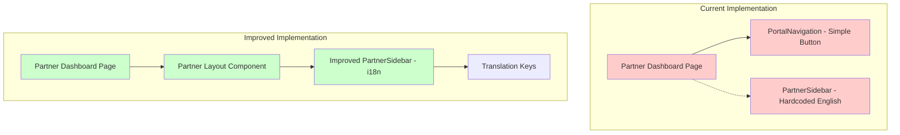
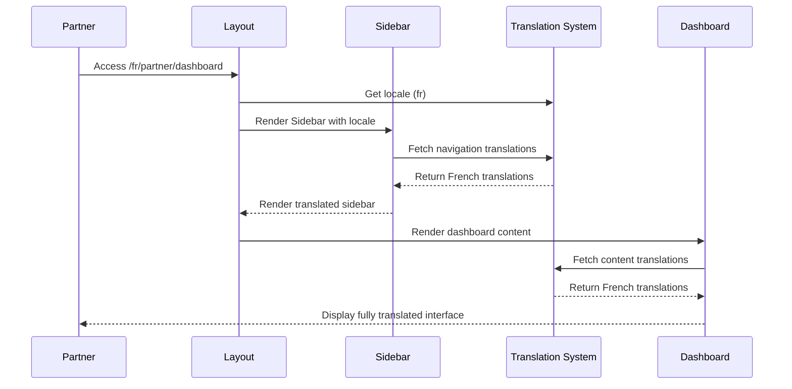

# Design Document - Partner Dashboard Improvements

## Overview

Cette conception vise à améliorer l'expérience utilisateur du dashboard partenaire en corrigeant les incohérences linguistiques, en éliminant les éléments redondants, et en enrichissant les fonctionnalités. Le système utilisera le framework de traduction next-intl existant et suivra les patterns établis dans l'application.

## Architecture

### Architecture Actuelle vs Améliorée



### Flux de Navigation Amélioré



## Components and Interfaces

### 1. Improved Partner Sidebar Component

#### PartnerSidebar (Refactored)
```typescript
interface PartnerSidebarProps {
  locale: string;
  currentPath?: string;
  userProfile?: {
    name: string;
    email: string;
    avatar?: string;
  };
}

interface NavigationItem {
  name: string;
  translationKey: string;
  href: string;
  icon: React.ComponentType;
  badge?: number;
  disabled?: boolean;
}

const PartnerSidebar: React.FC<PartnerSidebarProps> = ({ 
  locale, 
  currentPath,
  userProfile 
}) => {
  const t = useTranslations('partner.navigation');
  
  const navigationItems: NavigationItem[] = [
    {
      name: 'dashboard',
      translationKey: 'dashboard',
      href: `/${locale}/partner/dashboard`,
      icon: LayoutDashboard,
    },
    {
      name: 'properties',
      translationKey: 'properties',
      href: `/${locale}/partner/properties`,
      icon: Building2,
    },
    {
      name: 'bookings',
      translationKey: 'bookings',
      href: `/${locale}/partner/bookings`,
      icon: Calendar,
    },
    {
      name: 'revenue',
      translationKey: 'revenue',
      href: `/${locale}/partner/revenue`,
      icon: DollarSign,
    },
    {
      name: 'analytics',
      translationKey: 'analytics',
      href: `/${locale}/partner/analytics`,
      icon: BarChart3,
    },
    {
      name: 'messages',
      translationKey: 'messages',
      href: `/${locale}/partner/messages`,
      icon: MessageSquare,
    },
    {
      name: 'settings',
      translationKey: 'settings',
      href: `/${locale}/partner/settings`,
      icon: Settings,
    },
  ];
  
  return (
    <Sidebar>
      <SidebarHeader>
        <SidebarBranding locale={locale} />
      </SidebarHeader>
      
      <SidebarContent>
        <SidebarNavigation items={navigationItems} currentPath={currentPath} />
      </SidebarContent>
      
      <SidebarFooter>
        <UserProfile profile={userProfile} locale={locale} />
      </SidebarFooter>
    </Sidebar>
  );
};
```

### 2. Partner Layout Component

#### PartnerLayout
```typescript
interface PartnerLayoutProps {
  children: React.ReactNode;
  locale: string;
  showSidebar?: boolean;
}

const PartnerLayout: React.FC<PartnerLayoutProps> = ({ 
  children, 
  locale,
  showSidebar = true 
}) => {
  const [session, setSession] = useState<AuthSession | null>(null);
  
  useEffect(() => {
    async function loadSession() {
      const sessionData = await getSession();
      setSession(sessionData);
    }
    loadSession();
  }, []);
  
  return (
    <SidebarProvider>
      <div className="flex min-h-screen w-full">
        {showSidebar && session && (
          <PartnerSidebar 
            locale={locale}
            userProfile={{
              name: session.user.full_name || session.user.email,
              email: session.user.email,
            }}
          />
        )}
        <main className="flex-1 overflow-auto">
          {children}
        </main>
      </div>
    </SidebarProvider>
  );
};
```

### 3. Improved Dashboard Page Component

#### PartnerDashboardPage (Refactored)
```typescript
interface DashboardPageProps {
  params: {
    locale: string;
  };
}

export default function PartnerDashboardPage({ params }: DashboardPageProps) {
  const t = useTranslations('partner.dashboard');
  const [stats, setStats] = useState<PartnerStats | null>(null);
  const [properties, setProperties] = useState<PropertySummary[]>([]);
  const [loading, setLoading] = useState(true);
  
  // Remove duplicate titles - use single translated title
  return (
    <PartnerLayout locale={params.locale}>
      <div className="container mx-auto p-6">
        {/* Single, clear title */}
        <DashboardHeader 
          title={t('title')} 
          subtitle={t('subtitle')}
        />
        
        {/* Dashboard content */}
        <DashboardStats stats={stats} />
        <QuickActions locale={params.locale} />
        <PropertiesOverview properties={properties} />
        <RecentBookings locale={params.locale} />
      </div>
    </PartnerLayout>
  );
}
```

### 4. Dashboard Sub-Components

#### DashboardHeader
```typescript
interface DashboardHeaderProps {
  title: string;
  subtitle?: string;
  actions?: React.ReactNode;
}

const DashboardHeader: React.FC<DashboardHeaderProps> = ({ 
  title, 
  subtitle,
  actions 
}) => {
  return (
    <div className="mb-8">
      <div className="flex items-center justify-between">
        <div>
          <h1 className="text-3xl font-bold text-gray-900">
            {title}
          </h1>
          {subtitle && (
            <p className="mt-2 text-gray-600">
              {subtitle}
            </p>
          )}
        </div>
        {actions && (
          <div className="flex gap-2">
            {actions}
          </div>
        )}
      </div>
    </div>
  );
};
```

#### DashboardStats
```typescript
interface StatCardProps {
  icon: React.ComponentType;
  label: string;
  value: string | number;
  change?: {
    value: number;
    trend: 'up' | 'down' | 'neutral';
  };
  subtitle?: string;
}

const StatCard: React.FC<StatCardProps> = ({ 
  icon: Icon, 
  label, 
  value, 
  change,
  subtitle 
}) => {
  return (
    <Card>
      <CardContent className="p-6">
        <div className="flex items-center justify-between mb-2">
          <span className="text-sm font-medium text-gray-600">
            {label}
          </span>
          <Icon className="h-5 w-5 text-gray-400" />
        </div>
        <div className="text-2xl font-bold text-gray-900">
          {value}
        </div>
        {change && (
          <div className={cn(
            "text-sm mt-1",
            change.trend === 'up' && "text-green-600",
            change.trend === 'down' && "text-red-600",
            change.trend === 'neutral' && "text-gray-600"
          )}>
            {change.value > 0 ? '+' : ''}{change.value}%
          </div>
        )}
        {subtitle && (
          <p className="text-xs text-gray-500 mt-1">
            {subtitle}
          </p>
        )}
      </CardContent>
    </Card>
  );
};

interface DashboardStatsProps {
  stats: PartnerStats | null;
}

const DashboardStats: React.FC<DashboardStatsProps> = ({ stats }) => {
  const t = useTranslations('partner.dashboard.stats');
  
  if (!stats) return <StatsLoadingSkeleton />;
  
  return (
    <div className="grid grid-cols-1 md:grid-cols-2 lg:grid-cols-4 gap-6 mb-8">
      <StatCard
        icon={Building2}
        label={t('totalProperties')}
        value={stats.total_properties}
        subtitle={t('activeProperties', { count: stats.active_properties })}
      />
      <StatCard
        icon={Calendar}
        label={t('bookings')}
        value={stats.total_bookings}
        subtitle={t('upcomingBookings', { count: stats.upcoming_bookings })}
      />
      <StatCard
        icon={DollarSign}
        label={t('monthlyRevenue')}
        value={`${stats.monthly_earnings}€`}
        change={{
          value: 15,
          trend: 'up'
        }}
      />
      <StatCard
        icon={TrendingUp}
        label={t('occupancyRate')}
        value={`${Math.round(stats.occupancy_rate)}%`}
        subtitle={t('excellentRate')}
      />
    </div>
  );
};
```

#### QuickActions
```typescript
interface QuickActionsProps {
  locale: string;
}

const QuickActions: React.FC<QuickActionsProps> = ({ locale }) => {
  const t = useTranslations('partner.dashboard.actions');
  const router = useRouter();
  
  const actions = [
    {
      label: t('addProperty'),
      icon: Plus,
      href: `/${locale}/partner/properties/new`,
      variant: 'default' as const,
    },
    {
      label: t('manageProperties'),
      icon: Building2,
      href: `/${locale}/partner/properties`,
      variant: 'outline' as const,
    },
    {
      label: t('viewCalendar'),
      icon: Calendar,
      href: `/${locale}/partner/calendar`,
      variant: 'outline' as const,
    },
    {
      label: t('financialReports'),
      icon: FileText,
      href: `/${locale}/partner/reports`,
      variant: 'outline' as const,
    },
  ];
  
  return (
    <Card className="mb-8">
      <CardHeader>
        <CardTitle>{t('quickActions')}</CardTitle>
      </CardHeader>
      <CardContent>
        <div className="flex flex-wrap gap-3">
          {actions.map((action) => (
            <Button
              key={action.label}
              variant={action.variant}
              onClick={() => router.push(action.href)}
              className="flex items-center gap-2"
            >
              <action.icon className="h-4 w-4" />
              {action.label}
            </Button>
          ))}
        </div>
      </CardContent>
    </Card>
  );
};
```

## Data Models

### Partner Dashboard Statistics (Enhanced)
```typescript
interface PartnerStats {
  total_properties: number;
  active_properties: number;
  total_bookings: number;
  upcoming_bookings: number;
  monthly_earnings: number;
  yearly_earnings: number;
  occupancy_rate: number;
  average_rating: number;
  total_reviews: number;
  pending_requests: number;
  unread_messages: number;
}

interface PropertySummary {
  id: string;
  name: string;
  address: string;
  status: 'available' | 'occupied' | 'maintenance';
  price_per_night: number;
  bookings_count: number;
  earnings_this_month: number;
  occupancy_rate: number;
  average_rating: number;
  images: string[];
  next_booking?: {
    check_in: string;
    check_out: string;
    client_name: string;
  };
}

interface RecentBooking {
  id: string;
  booking_reference: string;
  check_in: string;
  check_out: string;
  guests: number;
  total_price: number;
  status: 'pending' | 'confirmed' | 'cancelled' | 'completed';
  payment_status: 'pending' | 'paid' | 'refunded' | 'failed';
  client_name: string;
  loft_name: string;
  loft_id: string;
}
```

## Translation Structure

### French Translation Keys (messages/fr.json)
```json
{
  "partner": {
    "navigation": {
      "dashboard": "Tableau de bord",
      "properties": "Mes propriétés",
      "bookings": "Réservations",
      "revenue": "Revenus",
      "analytics": "Analytiques",
      "messages": "Messages",
      "settings": "Paramètres",
      "profile": "Profil",
      "logout": "Déconnexion"
    },
    "dashboard": {
      "title": "Tableau de bord partenaire",
      "subtitle": "Gérez vos propriétés et suivez vos performances",
      "stats": {
        "totalProperties": "Propriétés totales",
        "activeProperties": "{count} actives",
        "bookings": "Réservations",
        "upcomingBookings": "{count} à venir",
        "monthlyRevenue": "Revenus ce mois",
        "occupancyRate": "Taux d'occupation",
        "excellentRate": "Excellent taux",
        "averageRating": "Note moyenne",
        "totalReviews": "{count} avis"
      },
      "actions": {
        "quickActions": "Actions rapides",
        "addProperty": "Ajouter une propriété",
        "manageProperties": "Gérer mes propriétés",
        "viewCalendar": "Voir le calendrier",
        "financialReports": "Rapports financiers"
      },
      "properties": {
        "title": "Mes propriétés",
        "viewAll": "Voir tout",
        "noProperties": "Aucune propriété",
        "noPropertiesMessage": "Ajoutez votre première propriété pour commencer à recevoir des réservations",
        "status": {
          "available": "Disponible",
          "occupied": "Occupé",
          "maintenance": "Maintenance"
        },
        "pricePerNight": "Prix/nuit",
        "bookingsCount": "Réservations",
        "monthlyRevenue": "Revenus/mois",
        "occupancy": "Occupation",
        "nextBooking": "Prochaine réservation"
      },
      "bookings": {
        "title": "Réservations récentes",
        "noBookings": "Aucune réservation récente",
        "status": {
          "pending": "En attente",
          "confirmed": "Confirmée",
          "cancelled": "Annulée",
          "completed": "Terminée"
        },
        "paymentStatus": {
          "pending": "En attente",
          "paid": "Payée",
          "refunded": "Remboursée",
          "failed": "Échec"
        }
      },
      "loading": "Chargement de votre dashboard...",
      "error": {
        "title": "Erreur de chargement",
        "message": "Une erreur s'est produite lors du chargement des données",
        "retry": "Réessayer"
      }
    },
    "branding": {
      "title": "Portail Partenaire",
      "subtitle": "Gestion de propriétés"
    }
  }
}
```

### English Translation Keys (messages/en.json)
```json
{
  "partner": {
    "navigation": {
      "dashboard": "Dashboard",
      "properties": "My Properties",
      "bookings": "Bookings",
      "revenue": "Revenue",
      "analytics": "Analytics",
      "messages": "Messages",
      "settings": "Settings",
      "profile": "Profile",
      "logout": "Logout"
    },
    "dashboard": {
      "title": "Partner Dashboard",
      "subtitle": "Manage your properties and track your performance",
      "stats": {
        "totalProperties": "Total Properties",
        "activeProperties": "{count} active",
        "bookings": "Bookings",
        "upcomingBookings": "{count} upcoming",
        "monthlyRevenue": "Monthly Revenue",
        "occupancyRate": "Occupancy Rate",
        "excellentRate": "Excellent rate",
        "averageRating": "Average Rating",
        "totalReviews": "{count} reviews"
      },
      "actions": {
        "quickActions": "Quick Actions",
        "addProperty": "Add Property",
        "manageProperties": "Manage Properties",
        "viewCalendar": "View Calendar",
        "financialReports": "Financial Reports"
      },
      "properties": {
        "title": "My Properties",
        "viewAll": "View All",
        "noProperties": "No properties",
        "noPropertiesMessage": "Add your first property to start receiving bookings",
        "status": {
          "available": "Available",
          "occupied": "Occupied",
          "maintenance": "Maintenance"
        },
        "pricePerNight": "Price/night",
        "bookingsCount": "Bookings",
        "monthlyRevenue": "Revenue/month",
        "occupancy": "Occupancy",
        "nextBooking": "Next booking"
      },
      "bookings": {
        "title": "Recent Bookings",
        "noBookings": "No recent bookings",
        "status": {
          "pending": "Pending",
          "confirmed": "Confirmed",
          "cancelled": "Cancelled",
          "completed": "Completed"
        },
        "paymentStatus": {
          "pending": "Pending",
          "paid": "Paid",
          "refunded": "Refunded",
          "failed": "Failed"
        }
      },
      "loading": "Loading your dashboard...",
      "error": {
        "title": "Loading Error",
        "message": "An error occurred while loading data",
        "retry": "Retry"
      }
    },
    "branding": {
      "title": "Partner Portal",
      "subtitle": "Property Management"
    }
  }
}
```

### Arabic Translation Keys (messages/ar.json)
```json
{
  "partner": {
    "navigation": {
      "dashboard": "لوحة التحكم",
      "properties": "عقاراتي",
      "bookings": "الحجوزات",
      "revenue": "الإيرادات",
      "analytics": "التحليلات",
      "messages": "الرسائل",
      "settings": "الإعدادات",
      "profile": "الملف الشخصي",
      "logout": "تسجيل الخروج"
    },
    "dashboard": {
      "title": "لوحة تحكم الشريك",
      "subtitle": "إدارة عقاراتك وتتبع أدائك",
      "stats": {
        "totalProperties": "إجمالي العقارات",
        "activeProperties": "{count} نشط",
        "bookings": "الحجوزات",
        "upcomingBookings": "{count} قادمة",
        "monthlyRevenue": "الإيرادات الشهرية",
        "occupancyRate": "معدل الإشغال",
        "excellentRate": "معدل ممتاز",
        "averageRating": "التقييم المتوسط",
        "totalReviews": "{count} تقييم"
      },
      "actions": {
        "quickActions": "إجراءات سريعة",
        "addProperty": "إضافة عقار",
        "manageProperties": "إدارة العقارات",
        "viewCalendar": "عرض التقويم",
        "financialReports": "التقارير المالية"
      },
      "properties": {
        "title": "عقاراتي",
        "viewAll": "عرض الكل",
        "noProperties": "لا توجد عقارات",
        "noPropertiesMessage": "أضف عقارك الأول لبدء استقبال الحجوزات",
        "status": {
          "available": "متاح",
          "occupied": "مشغول",
          "maintenance": "صيانة"
        },
        "pricePerNight": "السعر/ليلة",
        "bookingsCount": "الحجوزات",
        "monthlyRevenue": "الإيرادات/شهر",
        "occupancy": "الإشغال",
        "nextBooking": "الحجز القادم"
      },
      "bookings": {
        "title": "الحجوزات الأخيرة",
        "noBookings": "لا توجد حجوزات حديثة",
        "status": {
          "pending": "قيد الانتظار",
          "confirmed": "مؤكد",
          "cancelled": "ملغى",
          "completed": "مكتمل"
        },
        "paymentStatus": {
          "pending": "قيد الانتظار",
          "paid": "مدفوع",
          "refunded": "مسترد",
          "failed": "فشل"
        }
      },
      "loading": "جاري تحميل لوحة التحكم...",
      "error": {
        "title": "خطأ في التحميل",
        "message": "حدث خطأ أثناء تحميل البيانات",
        "retry": "إعادة المحاولة"
      }
    },
    "branding": {
      "title": "بوابة الشريك",
      "subtitle": "إدارة العقارات"
    }
  }
}
```

## Error Handling

### Error Types and Messages
```typescript
enum PartnerDashboardErrorCodes {
  STATS_LOAD_FAILED = 'STATS_LOAD_FAILED',
  PROPERTIES_LOAD_FAILED = 'PROPERTIES_LOAD_FAILED',
  BOOKINGS_LOAD_FAILED = 'BOOKINGS_LOAD_FAILED',
  UNAUTHORIZED = 'UNAUTHORIZED',
  SESSION_EXPIRED = 'SESSION_EXPIRED',
}

interface DashboardError {
  code: PartnerDashboardErrorCodes;
  message: string;
  retryable: boolean;
}

const handleDashboardError = (error: DashboardError, t: Function) => {
  switch (error.code) {
    case PartnerDashboardErrorCodes.STATS_LOAD_FAILED:
      return {
        title: t('error.stats.title'),
        message: t('error.stats.message'),
        action: error.retryable ? 'retry' : 'contact_support',
      };
    case PartnerDashboardErrorCodes.UNAUTHORIZED:
      return {
        title: t('error.unauthorized.title'),
        message: t('error.unauthorized.message'),
        action: 'redirect_login',
      };
    default:
      return {
        title: t('error.generic.title'),
        message: t('error.generic.message'),
        action: 'retry',
      };
  }
};
```

## Testing Strategy

### Unit Tests
- PartnerSidebar component rendering with different locales
- Translation key resolution for all supported languages
- Navigation item active state detection
- User profile display in sidebar footer

### Integration Tests
- Complete dashboard page rendering with sidebar
- Language switching functionality
- Navigation between dashboard sections
- Data loading and error handling

### Visual Regression Tests
- Sidebar appearance in different locales
- Dashboard layout with and without data
- Responsive behavior on mobile devices
- Dark mode compatibility (if applicable)

### Accessibility Tests
- Keyboard navigation through sidebar
- Screen reader compatibility
- ARIA labels for all interactive elements
- Color contrast compliance

## Performance Optimizations

### Component Optimization
```typescript
// Memoize navigation items to prevent unnecessary re-renders
const navigationItems = useMemo(() => [
  // ... navigation items
], [locale]);

// Lazy load dashboard sections
const PropertiesOverview = lazy(() => import('./PropertiesOverview'));
const RecentBookings = lazy(() => import('./RecentBookings'));

// Use React.memo for static components
export const DashboardHeader = React.memo(DashboardHeaderComponent);
```

### Data Fetching Optimization
```typescript
// Use SWR or React Query for data fetching with caching
const { data: stats, error, mutate } = useSWR(
  `/api/partner/dashboard/stats`,
  fetcher,
  {
    refreshInterval: 300000, // 5 minutes
    revalidateOnFocus: false,
  }
);

// Parallel data fetching
const fetchDashboardData = async () => {
  const [stats, properties, bookings] = await Promise.all([
    fetch('/api/partner/dashboard/stats'),
    fetch('/api/partner/properties?summary=true'),
    fetch('/api/partner/bookings?limit=5'),
  ]);
  
  return {
    stats: await stats.json(),
    properties: await properties.json(),
    bookings: await bookings.json(),
  };
};
```

## Security Considerations

### Authentication & Authorization
- Verify partner role before rendering dashboard
- Implement session validation on every page load
- Add CSRF protection for all mutations
- Validate partner ownership of displayed data

### Data Protection
- Never expose other partners' data in API responses
- Implement proper RLS policies at database level
- Sanitize all user inputs
- Log all data access attempts for audit

## Deployment Considerations

### Migration Strategy
1. Create new improved components alongside existing ones
2. Add feature flag to toggle between old and new dashboard
3. Test thoroughly in staging environment
4. Gradual rollout to production (10% → 50% → 100%)
5. Monitor error rates and user feedback
6. Remove old components after successful migration

### Rollback Plan
- Keep old dashboard components for 2 weeks after full rollout
- Implement quick toggle to revert to old dashboard if issues arise
- Monitor key metrics (page load time, error rate, user engagement)
- Have database backup ready before deployment

### Monitoring
- Track dashboard page load times
- Monitor API endpoint response times
- Log translation key misses
- Track user navigation patterns
- Alert on error rate spikes
