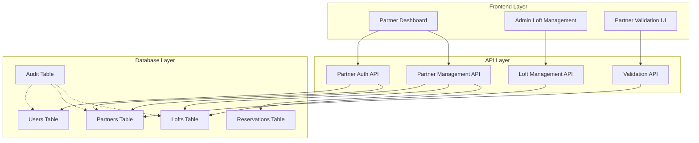
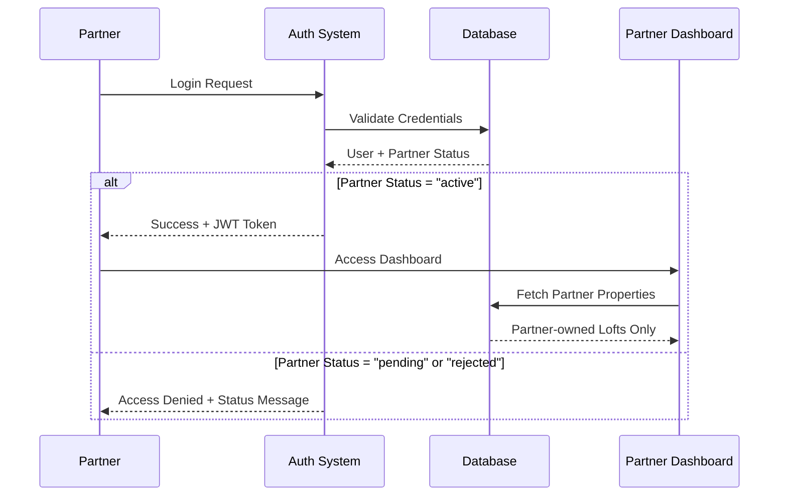

# Design Document - Partner Dashboard System

## Overview

Le système de dashboard des partenaires est conçu pour permettre aux propriétaires de biens immobiliers de confier la gestion de leurs propriétés à la plateforme. Le système suit une architecture de séparation des responsabilités où les partenaires ont un accès en lecture seule à leurs biens, tandis que les administrateurs gèrent toutes les opérations CRUD.

## Architecture

### Architecture Générale



### Flux d'Authentification et d'Autorisation



## Components and Interfaces

### 1. Authentication & Authorization Components

#### PartnerAuthGuard
```typescript
interface PartnerAuthGuardProps {
  children: React.ReactNode;
  requiredStatus?: 'active' | 'pending' | 'any';
}
```

#### PartnerLoginForm
```typescript
interface PartnerLoginFormProps {
  onSuccess?: (user: User) => void;
  onError?: (error: string) => void;
  redirectTo?: string;
}
```

### 2. Registration & Validation Components

#### PartnerRegistrationForm
```typescript
interface PartnerRegistrationData {
  personal_info: {
    full_name: string;
    email: string;
    phone: string;
    address: string;
  };
  business_info: {
    business_name?: string;
    business_type: 'individual' | 'company';
    tax_id?: string;
  };
  portfolio_description: string;
  verification_documents: File[];
}
```

#### AdminPartnerValidation
```typescript
interface ValidationRequest {
  id: string;
  partner_id: string;
  submitted_at: string;
  status: 'pending' | 'approved' | 'rejected';
  partner_data: PartnerRegistrationData;
  admin_notes?: string;
}
```

### 3. Dashboard Components

#### PartnerDashboardLayout
```typescript
interface PartnerDashboardLayoutProps {
  children: React.ReactNode;
  partner: PartnerProfile;
  sidebarItems: SidebarItem[];
}
```

#### PartnerPropertiesView
```typescript
interface PartnerPropertiesViewProps {
  partnerId: string;
  filters?: PropertyFilters;
  viewMode: 'grid' | 'list';
}
```

#### PartnerRevenueReports
```typescript
interface RevenueReportProps {
  partnerId: string;
  dateRange: {
    from: Date;
    to: Date;
  };
  groupBy: 'day' | 'week' | 'month';
}
```

### 4. Admin Management Components

#### AdminLoftManagement
```typescript
interface AdminLoftManagementProps {
  partnerId?: string;
  loftId?: string;
  mode: 'create' | 'edit' | 'view';
}
```

#### PartnerLoftCRUD
```typescript
interface LoftCRUDOperations {
  create: (loftData: CreateLoftData, partnerId: string) => Promise<Loft>;
  update: (loftId: string, updates: UpdateLoftData) => Promise<Loft>;
  delete: (loftId: string) => Promise<void>;
  assignToPartner: (loftId: string, partnerId: string) => Promise<void>;
}
```

## Data Models

### Extended Partner Profile
```typescript
interface ExtendedPartnerProfile extends PartnerProfile {
  // Existing fields from types.ts
  id: string;
  user_id: string;
  business_name?: string;
  business_type: BusinessType;
  tax_id?: string;
  address: string;
  phone: string;
  verification_status: VerificationStatus;
  verification_documents: string[];
  bank_details: Record<string, any>;
  created_at: string;
  updated_at: string;
  
  // New fields for dashboard system
  portfolio_description?: string;
  admin_notes?: string;
  approved_at?: string;
  approved_by?: string;
  rejected_at?: string;
  rejected_by?: string;
  rejection_reason?: string;
  last_login_at?: string;
  properties_count?: number;
  total_revenue?: number;
  active_reservations_count?: number;
}
```

### Partner Dashboard Statistics
```typescript
interface PartnerDashboardStats {
  properties: {
    total: number;
    available: number;
    occupied: number;
    maintenance: number;
  };
  revenue: {
    current_month: number;
    previous_month: number;
    year_to_date: number;
    currency: string;
  };
  reservations: {
    active: number;
    upcoming: number;
    completed_this_month: number;
  };
  occupancy_rate: {
    current_month: number;
    previous_month: number;
  };
}
```

### Partner Property View
```typescript
interface PartnerPropertyView extends Loft {
  // Read-only view with additional computed fields
  current_occupancy_status: 'available' | 'occupied' | 'maintenance';
  next_reservation?: {
    check_in: string;
    check_out: string;
    guest_name: string;
  };
  revenue_this_month: number;
  revenue_last_month: number;
  total_reservations: number;
  average_rating: number;
  last_maintenance_date?: string;
  images: string[];
}
```

## Database Schema Extensions

### Partners Table Enhancement
```sql
-- Extend existing partners table or create if not exists
CREATE TABLE IF NOT EXISTS partners (
  id UUID PRIMARY KEY DEFAULT gen_random_uuid(),
  user_id UUID REFERENCES auth.users(id) ON DELETE CASCADE,
  business_name TEXT,
  business_type TEXT CHECK (business_type IN ('individual', 'company')),
  tax_id TEXT,
  address TEXT NOT NULL,
  phone TEXT NOT NULL,
  verification_status TEXT DEFAULT 'pending' CHECK (verification_status IN ('pending', 'approved', 'rejected')),
  verification_documents TEXT[],
  bank_details JSONB,
  portfolio_description TEXT,
  admin_notes TEXT,
  approved_at TIMESTAMPTZ,
  approved_by UUID REFERENCES auth.users(id),
  rejected_at TIMESTAMPTZ,
  rejected_by UUID REFERENCES auth.users(id),
  rejection_reason TEXT,
  last_login_at TIMESTAMPTZ,
  created_at TIMESTAMPTZ DEFAULT NOW(),
  updated_at TIMESTAMPTZ DEFAULT NOW()
);
```

### Partner Validation Requests Table
```sql
CREATE TABLE partner_validation_requests (
  id UUID PRIMARY KEY DEFAULT gen_random_uuid(),
  partner_id UUID REFERENCES partners(id) ON DELETE CASCADE,
  status TEXT DEFAULT 'pending' CHECK (status IN ('pending', 'approved', 'rejected')),
  submitted_data JSONB NOT NULL,
  admin_notes TEXT,
  processed_by UUID REFERENCES auth.users(id),
  processed_at TIMESTAMPTZ,
  created_at TIMESTAMPTZ DEFAULT NOW()
);
```

### Row Level Security (RLS) Policies

```sql
-- Partners can only see their own data
CREATE POLICY "Partners can view own profile" ON partners
  FOR SELECT USING (user_id = auth.uid());

-- Partners can only see their own properties
CREATE POLICY "Partners can view own properties" ON lofts
  FOR SELECT USING (
    partner_id IN (
      SELECT id FROM partners WHERE user_id = auth.uid()
    )
  );

-- Partners can only see reservations for their properties
CREATE POLICY "Partners can view own property reservations" ON reservations
  FOR SELECT USING (
    loft_id IN (
      SELECT l.id FROM lofts l
      JOIN partners p ON l.partner_id = p.id
      WHERE p.user_id = auth.uid()
    )
  );

-- Admins have full access
CREATE POLICY "Admins have full access" ON partners
  FOR ALL USING (
    EXISTS (
      SELECT 1 FROM auth.users 
      WHERE id = auth.uid() 
      AND raw_user_meta_data->>'role' = 'admin'
    )
  );
```

## API Endpoints

### Partner Authentication
```typescript
// POST /api/partner/auth/login
interface PartnerLoginRequest {
  email: string;
  password: string;
}

interface PartnerLoginResponse {
  user: User;
  partner: ExtendedPartnerProfile;
  token: string;
  dashboard_url: string;
}
```

### Partner Registration
```typescript
// POST /api/partner/register
interface PartnerRegistrationRequest extends PartnerRegistrationData {
  password: string;
  confirm_password: string;
  terms_accepted: boolean;
}

interface PartnerRegistrationResponse {
  success: boolean;
  message: string;
  partner_id?: string;
  validation_required: boolean;
}
```

### Partner Dashboard Data
```typescript
// GET /api/partner/dashboard
interface PartnerDashboardResponse {
  partner: ExtendedPartnerProfile;
  statistics: PartnerDashboardStats;
  properties: PartnerPropertyView[];
  recent_reservations: ReservationSummary[];
}
```

### Admin Partner Management
```typescript
// GET /api/admin/partners/validation-requests
interface ValidationRequestsResponse {
  requests: ValidationRequest[];
  total: number;
  page: number;
  limit: number;
}

// POST /api/admin/partners/{id}/approve
interface ApprovalRequest {
  admin_notes?: string;
}

// POST /api/admin/partners/{id}/reject
interface RejectionRequest {
  rejection_reason: string;
  admin_notes?: string;
}
```

## Error Handling

### Partner-Specific Error Types
```typescript
enum PartnerErrorCodes {
  PARTNER_NOT_FOUND = 'PARTNER_NOT_FOUND',
  PARTNER_NOT_APPROVED = 'PARTNER_NOT_APPROVED',
  PARTNER_REJECTED = 'PARTNER_REJECTED',
  PARTNER_SUSPENDED = 'PARTNER_SUSPENDED',
  INSUFFICIENT_PERMISSIONS = 'INSUFFICIENT_PERMISSIONS',
  PROPERTY_NOT_OWNED = 'PROPERTY_NOT_OWNED',
  VALIDATION_PENDING = 'VALIDATION_PENDING'
}

interface PartnerError extends Error {
  code: PartnerErrorCodes;
  details?: Record<string, any>;
  redirect_url?: string;
}
```

### Error Handling Middleware
```typescript
const partnerErrorHandler = (error: PartnerError, req: Request, res: Response) => {
  switch (error.code) {
    case PartnerErrorCodes.PARTNER_NOT_APPROVED:
      return res.status(403).json({
        error: 'Account pending approval',
        message: 'Your partner account is awaiting administrative approval.',
        redirect_url: '/partner/pending'
      });
    
    case PartnerErrorCodes.PROPERTY_NOT_OWNED:
      return res.status(403).json({
        error: 'Access denied',
        message: 'You do not have access to this property.'
      });
    
    default:
      return res.status(500).json({
        error: 'Internal server error',
        message: 'An unexpected error occurred.'
      });
  }
};
```

## Testing Strategy

### Unit Tests
- Partner authentication logic
- Data access layer with RLS policies
- Partner dashboard statistics calculations
- Admin validation workflows

### Integration Tests
- Partner registration flow end-to-end
- Admin approval/rejection process
- Partner dashboard data loading
- Property access restrictions

### Security Tests
- RLS policy enforcement
- Partner data isolation
- Admin privilege escalation prevention
- Session management and token validation

### Performance Tests
- Dashboard loading with large property portfolios
- Revenue calculation queries
- Concurrent partner access
- Database query optimization

## Security Considerations

### Data Isolation
- Strict RLS policies ensuring partners only access their own data
- Database-level constraints preventing cross-partner data access
- API-level validation of partner ownership

### Authentication & Authorization
- JWT token-based authentication with partner-specific claims
- Role-based access control with partner/admin distinction
- Session management with automatic expiration

### Audit Trail
- All partner actions logged in audit system
- Admin actions on partner accounts tracked
- Property access attempts monitored

### Data Protection
- Partner personal information encrypted at rest
- Secure file upload for verification documents
- GDPR compliance for partner data handling

## Performance Optimizations

### Database Optimizations
```sql
-- Indexes for partner queries
CREATE INDEX idx_partners_user_id ON partners(user_id);
CREATE INDEX idx_partners_verification_status ON partners(verification_status);
CREATE INDEX idx_lofts_partner_id ON lofts(partner_id);
CREATE INDEX idx_reservations_loft_partner ON reservations(loft_id) 
  WHERE loft_id IN (SELECT id FROM lofts WHERE partner_id IS NOT NULL);
```

### Caching Strategy
- Partner dashboard statistics cached for 15 minutes
- Property lists cached with invalidation on updates
- Revenue calculations cached daily
- Redis-based session storage for scalability

### Query Optimization
- Materialized views for complex partner statistics
- Batch loading of related data (properties, reservations)
- Pagination for large datasets
- Optimized joins with proper indexing

## Deployment Considerations

### Environment Configuration
```typescript
interface PartnerSystemConfig {
  partner_registration_enabled: boolean;
  auto_approval_enabled: boolean;
  max_properties_per_partner: number;
  document_upload_max_size: number;
  supported_document_types: string[];
  email_notifications_enabled: boolean;
  sms_notifications_enabled: boolean;
}
```

### Feature Flags
- Partner registration toggle
- Auto-approval for trusted partners
- Advanced analytics features
- Multi-language support

### Monitoring & Alerts
- Partner registration rate monitoring
- Dashboard performance metrics
- Failed login attempt tracking
- Revenue calculation accuracy checks