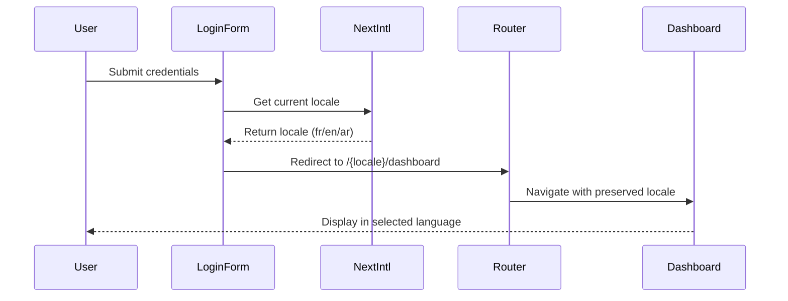

# Design Document

## Overview

Cette fonctionnalité modifie la logique de redirection post-login pour préserver la langue sélectionnée par l'utilisateur sur la page de login. Au lieu de rediriger vers "/" (racine), le système redirigera vers "/{locale}/dashboard" en utilisant la locale actuelle détectée par next-intl.

## Architecture

### Composants Impliqués

1. **SimpleLoginFormNextIntl** - Le formulaire de login qui gère la redirection
2. **LoginPageClientNextIntl** - Le composant parent qui fournit la locale
3. **next-intl middleware** - Gère la détection et persistance de locale
4. **useLocale hook** - Fournit la locale actuelle

### Flux de Redirection



## Components and Interfaces

### Modified SimpleLoginFormNextIntl

**Current Implementation:**
```typescript
router.push("/")
```

**New Implementation:**
```typescript
const locale = useLocale()
router.push(`/${locale}/dashboard`)
```

### Locale Detection Strategy

1. **Primary**: Utilise `useLocale()` de next-intl pour obtenir la locale actuelle
2. **Fallback**: Si la locale n'est pas disponible, utilise 'fr' par défaut
3. **Validation**: Vérifie que la locale est dans la liste des locales supportées

### URL Structure

- **Avant**: `/login` → `/` (redirection vers racine)
- **Après**: `/fr/login` → `/fr/dashboard` (préservation de locale)

## Data Models

### Locale Configuration

```typescript
// Existing in i18n.ts
export const locales = ['fr', 'en', 'ar'] as const;
export type Locale = typeof locales[number];
```

### Redirect Configuration

```typescript
interface RedirectConfig {
  locale: Locale;
  targetPath: string; // '/dashboard'
  fallbackPath: string; // '/fr/dashboard'
}
```

## Error Handling

### Scenarios d'Erreur

1. **Locale Invalide**: Si la locale détectée n'est pas supportée
   - **Action**: Utiliser 'fr' comme fallback
   - **Log**: Enregistrer l'erreur pour debugging

2. **Échec de Redirection**: Si router.push échoue
   - **Action**: Afficher un message d'erreur avec lien manuel
   - **Fallback**: Redirection vers `/fr/dashboard`

3. **Locale Undefined**: Si useLocale() retourne undefined
   - **Action**: Utiliser la locale par défaut 'fr'
   - **Log**: Enregistrer l'incident

### Implementation

```typescript
const handleRedirect = (locale: string | undefined) => {
  try {
    const validLocale = locale && locales.includes(locale as Locale) 
      ? locale 
      : 'fr';
    
    router.push(`/${validLocale}/dashboard`);
  } catch (error) {
    console.error('Redirect failed:', error);
    // Fallback manual redirect
    window.location.href = '/fr/dashboard';
  }
};
```

## Testing Strategy

### Unit Tests

1. **Locale Detection Tests**
   - Tester avec chaque locale supportée (fr, en, ar)
   - Tester avec locale invalide
   - Tester avec locale undefined

2. **Redirect Logic Tests**
   - Vérifier la construction correcte de l'URL
   - Tester les fallbacks en cas d'erreur
   - Valider la gestion des cas edge

### Integration Tests

1. **End-to-End Login Flow**
   - Login depuis `/fr/login` → vérifier redirection vers `/fr/dashboard`
   - Login depuis `/en/login` → vérifier redirection vers `/en/dashboard`
   - Login depuis `/ar/login` → vérifier redirection vers `/ar/dashboard`

2. **Language Persistence Tests**
   - Vérifier que la langue reste cohérente après redirection
   - Tester le changement de langue avant login
   - Valider la persistance dans les cookies/localStorage

### Manual Testing Checklist

- [ ] Login en français et vérifier redirection vers `/fr/dashboard`
- [ ] Login en anglais et vérifier redirection vers `/en/dashboard`
- [ ] Login en arabe et vérifier redirection vers `/ar/dashboard`
- [ ] Changer de langue sur login page puis se connecter
- [ ] Vérifier que les menus restent identiques à avant
- [ ] Tester avec utilisateur déjà connecté
- [ ] Valider les messages d'erreur en cas de problème

## Implementation Notes

### Minimal Changes Required

1. **Seul fichier à modifier**: `components/auth/simple-login-form-nextintl.tsx`
2. **Import ajouté**: `useLocale` de next-intl
3. **Logique modifiée**: Ligne de redirection dans `onSubmit`

### Backward Compatibility

- Les anciennes URLs sans locale seront gérées par le middleware next-intl
- Redirection automatique vers la locale appropriée
- Aucun impact sur les utilisateurs existants

### Performance Considerations

- `useLocale()` est un hook léger sans impact performance
- Construction d'URL simple sans calculs complexes
- Pas de requêtes réseau supplémentaires