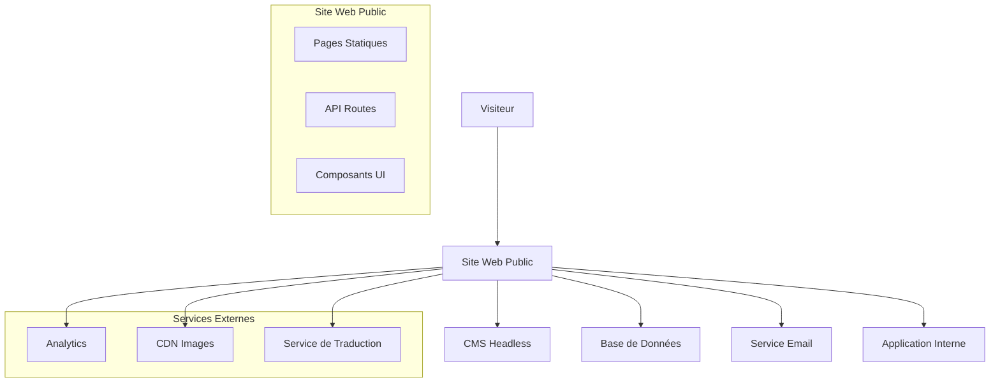

# Design Document - Site Web Public

## Overview

Le site web public sera développé comme une application web moderne et performante, séparée de l'application interne existante. Il servira de vitrine digitale pour présenter les services de gestion de lofts/hébergements, avec un focus sur la conversion de visiteurs en prospects qualifiés.

### Architecture Technique

- **Framework**: Next.js 15 avec App Router et les dernières optimisations pour les performances et le SEO
- **Styling**: Tailwind CSS pour un design responsive et moderne
- **CMS**: Sanity.io ou Strapi pour la gestion de contenu
- **Hébergement**: Vercel ou Netlify pour le déploiement automatique
- **Base de données**: PostgreSQL pour les formulaires de contact et analytics

## Architecture

### Architecture Globale



### Structure des Pages

1. **Page d'Accueil** (`/`)
   - Hero section avec proposition de valeur
   - Aperçu des services principaux
   - Témoignages clients
   - Call-to-action vers contact

2. **Services** (`/services`)
   - Page principale listant tous les services
   - Pages détaillées par service (`/services/[slug]`)

3. **Portfolio** (`/portfolio`)
   - Galerie de propriétés gérées
   - Filtres par type, localisation, caractéristiques
   - Pages détaillées par propriété (`/portfolio/[id]`)

4. **À Propos** (`/about`)
   - Histoire de l'entreprise
   - Équipe et expertise
   - Valeurs et mission

5. **Contact** (`/contact`)
   - Formulaire de contact principal
   - Informations de contact
   - Carte de localisation

6. **Actualités** (`/blog`)
   - Articles et actualités du secteur
   - Conseils pour propriétaires
   - Études de cas

7. **Accès Application** (`/app`)
   - Redirection sécurisée vers l'application interne
   - Page de connexion si nécessaire

## Components and Interfaces

### Composants Principaux

#### 1. Layout Components
```typescript
// components/layout/Header.tsx
interface HeaderProps {
  locale: string;
  navigation: NavigationItem[];
}

// components/layout/Footer.tsx
interface FooterProps {
  contactInfo: ContactInfo;
  socialLinks: SocialLink[];
}
```

#### 2. Content Components
```typescript
// components/ui/PropertyCard.tsx
interface PropertyCardProps {
  property: {
    id: string;
    title: string;
    location: string;
    images: string[];
    features: string[];
    type: PropertyType;
  };
}

// components/ui/ServiceCard.tsx
interface ServiceCardProps {
  service: {
    title: string;
    description: string;
    icon: string;
    features: string[];
    ctaLink: string;
  };
}
```

#### 3. Form Components
```typescript
// components/forms/ContactForm.tsx
interface ContactFormProps {
  onSubmit: (data: ContactFormData) => Promise<void>;
  locale: string;
}

interface ContactFormData {
  name: string;
  email: string;
  phone?: string;
  subject: string;
  message: string;
  propertyType?: PropertyType;
  preferredContact: 'email' | 'phone';
}
```

#### 4. Interactive Components
```typescript
// components/ui/PropertyFilter.tsx
interface PropertyFilterProps {
  filters: FilterOptions;
  onFilterChange: (filters: FilterOptions) => void;
}

// components/ui/ImageGallery.tsx
interface ImageGalleryProps {
  images: ImageData[];
  alt: string;
  lazy?: boolean;
}
```

## Data Models

### Content Management

```typescript
// types/content.ts
interface Page {
  id: string;
  slug: string;
  title: Record<string, string>; // Multi-langue
  content: Record<string, any>; // Contenu structuré
  seo: SEOData;
  publishedAt: Date;
  updatedAt: Date;
}

interface Property {
  id: string;
  title: Record<string, string>;
  description: Record<string, string>;
  location: {
    address: string;
    city: string;
    coordinates: [number, number];
  };
  images: ImageData[];
  features: string[];
  type: PropertyType;
  status: 'active' | 'inactive';
  order: number;
}

interface Service {
  id: string;
  title: Record<string, string>;
  description: Record<string, string>;
  longDescription: Record<string, any>;
  icon: string;
  features: Record<string, string[]>;
  pricing?: PricingInfo;
  order: number;
}
```

### User Interactions

```typescript
// types/forms.ts
interface ContactSubmission {
  id: string;
  name: string;
  email: string;
  phone?: string;
  subject: string;
  message: string;
  source: 'contact-form' | 'property-inquiry' | 'service-inquiry';
  metadata: Record<string, any>;
  status: 'new' | 'contacted' | 'qualified' | 'converted';
  submittedAt: Date;
}

interface NewsletterSubscription {
  id: string;
  email: string;
  locale: string;
  source: string;
  subscribedAt: Date;
  status: 'active' | 'unsubscribed';
}
```

### Analytics & SEO

```typescript
// types/analytics.ts
interface PageView {
  id: string;
  path: string;
  referrer?: string;
  userAgent: string;
  locale: string;
  timestamp: Date;
  sessionId: string;
}

interface SEOData {
  title: Record<string, string>;
  description: Record<string, string>;
  keywords: Record<string, string[]>;
  ogImage?: string;
  canonical?: string;
  noIndex?: boolean;
}
```

## Error Handling

### Client-Side Error Handling

1. **Form Validation**
   - Validation en temps réel avec react-hook-form + zod
   - Messages d'erreur contextuels et multilingues
   - Gestion des erreurs réseau et timeouts

2. **Image Loading**
   - Fallback images pour les erreurs de chargement
   - Lazy loading avec intersection observer
   - Optimisation automatique des formats (WebP, AVIF)

3. **Navigation Errors**
   - Pages 404 personnalisées avec suggestions
   - Redirections automatiques pour les anciennes URLs
   - Breadcrumbs pour faciliter la navigation

### Server-Side Error Handling

```typescript
// lib/error-handler.ts
class APIError extends Error {
  constructor(
    message: string,
    public statusCode: number,
    public code: string
  ) {
    super(message);
  }
}

// Middleware de gestion d'erreurs
export function errorHandler(error: Error, req: Request, res: Response) {
  if (error instanceof APIError) {
    return res.status(error.statusCode).json({
      error: error.message,
      code: error.code
    });
  }
  
  // Log des erreurs inattendues
  console.error('Unexpected error:', error);
  return res.status(500).json({
    error: 'Internal server error',
    code: 'INTERNAL_ERROR'
  });
}
```

## Testing Strategy

### Tests Unitaires
- **Composants UI**: Testing Library + Jest
- **Utilitaires**: Jest pour les fonctions pures
- **API Routes**: Supertest pour les endpoints

### Tests d'Intégration
- **Formulaires**: Tests end-to-end avec Playwright
- **Navigation**: Tests de parcours utilisateur complets
- **CMS Integration**: Tests de synchronisation de contenu

### Tests de Performance
- **Lighthouse CI**: Scores de performance automatisés
- **Bundle Analysis**: Surveillance de la taille des bundles
- **Core Web Vitals**: Monitoring continu des métriques

### Tests d'Accessibilité
- **axe-core**: Tests automatisés d'accessibilité
- **Keyboard Navigation**: Tests de navigation au clavier
- **Screen Reader**: Tests avec lecteurs d'écran

### Stratégie de Déploiement

1. **Environnements**
   - **Development**: Local avec hot reload
   - **Staging**: Preview deployments sur Vercel
   - **Production**: Déploiement automatique depuis main branch

2. **CI/CD Pipeline**
   ```yaml
   # .github/workflows/deploy.yml
   - Tests unitaires et d'intégration
   - Audit de sécurité (npm audit)
   - Build et optimisation
   - Tests de performance
   - Déploiement conditionnel
   ```

3. **Monitoring**
   - **Uptime**: Surveillance 24/7 avec alertes
   - **Performance**: Real User Monitoring (RUM)
   - **Erreurs**: Sentry pour le tracking d'erreurs
   - **Analytics**: Google Analytics 4 + données propriétaires