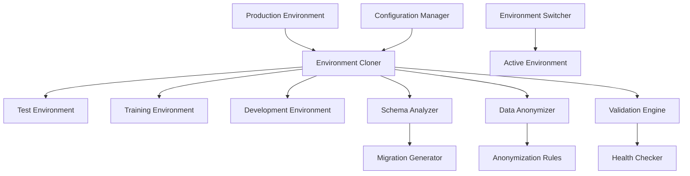

# Design Document - Test/Training Environment Setup System

## Overview

Ce système automatise la création d'environnements de test et de formation identiques à la production pour le système Loft Algérie. Il gère le clonage complet de la base de données incluant tous les systèmes avancés (audit, conversations, réservations, notifications) tout en anonymisant les données sensibles.

## Architecture

### High-Level Architecture



### System Components

1. **Environment Cloner**: Orchestrateur principal du clonage
2. **Schema Analyzer**: Analyse et compare les schémas de base de données
3. **Data Anonymizer**: Anonymise les données sensibles
4. **Validation Engine**: Valide la cohérence des environnements clonés
5. **Configuration Manager**: Gère les fichiers de configuration d'environnement
6. **Environment Switcher**: Permet de basculer entre environnements

## Components and Interfaces

### 1. Environment Cloner

**Responsabilités:**
- Orchestrer le processus de clonage complet
- Gérer l'ordre des opérations (schéma → données → validation)
- Coordonner avec tous les autres composants

**Interface:**
```typescript
interface EnvironmentCloner {
  cloneEnvironment(source: Environment, target: Environment, options: CloneOptions): Promise<CloneResult>
  validateClone(environment: Environment): Promise<ValidationResult>
  rollbackClone(environment: Environment, backupId: string): Promise<void>
}

interface CloneOptions {
  anonymizeData: boolean
  includeAuditLogs: boolean
  includeConversations: boolean
  includeReservations: boolean
  preserveUserRoles: boolean
  customAnonymizationRules?: AnonymizationRule[]
}
```

### 2. Schema Analyzer

**Responsabilités:**
- Analyser les schémas de base de données
- Détecter les différences entre environnements
- Générer les scripts de migration

**Interface:**
```typescript
interface SchemaAnalyzer {
  analyzeSchema(environment: Environment): Promise<SchemaDefinition>
  compareSchemas(source: SchemaDefinition, target: SchemaDefinition): Promise<SchemaDiff>
  generateMigrationScript(diff: SchemaDiff): Promise<MigrationScript>
}

interface SchemaDefinition {
  tables: TableDefinition[]
  functions: FunctionDefinition[]
  triggers: TriggerDefinition[]
  indexes: IndexDefinition[]
  policies: PolicyDefinition[]
  schemas: string[] // audit, public, etc.
}
```

### 3. Data Anonymizer

**Responsabilités:**
- Anonymiser les données personnelles et sensibles
- Préserver l'intégrité référentielle
- Maintenir la cohérence des données

**Interface:**
```typescript
interface DataAnonymizer {
  anonymizeTable(tableName: string, data: any[], rules: AnonymizationRule[]): Promise<any[]>
  generateFakeData(dataType: DataType, constraints?: any): any
  preserveRelationships(data: RelationalData): Promise<RelationalData>
}

interface AnonymizationRule {
  tableName: string
  columnName: string
  anonymizationType: 'email' | 'name' | 'phone' | 'address' | 'custom'
  customGenerator?: (originalValue: any) => any
  preserveFormat?: boolean
}
```

### 4. Validation Engine

**Responsabilités:**
- Valider la cohérence des données clonées
- Tester les fonctionnalités principales
- Générer des rapports de santé

**Interface:**
```typescript
interface ValidationEngine {
  validateEnvironment(environment: Environment): Promise<ValidationResult>
  runHealthChecks(environment: Environment): Promise<HealthReport>
  testFunctionality(environment: Environment, tests: TestSuite[]): Promise<TestResult[]>
}

interface ValidationResult {
  isValid: boolean
  errors: ValidationError[]
  warnings: ValidationWarning[]
  statistics: EnvironmentStatistics
}
```

## Data Models

### Environment Configuration

```typescript
interface Environment {
  id: string
  name: string
  type: 'production' | 'test' | 'training' | 'development'
  supabaseUrl: string
  supabaseAnonKey: string
  supabaseServiceKey: string
  databaseUrl: string
  status: 'active' | 'inactive' | 'cloning' | 'error'
  createdAt: Date
  lastUpdated: Date
}
```

### Clone Operation

```typescript
interface CloneOperation {
  id: string
  sourceEnvironment: string
  targetEnvironment: string
  status: 'pending' | 'in_progress' | 'completed' | 'failed'
  progress: number
  startedAt: Date
  completedAt?: Date
  logs: CloneLog[]
  statistics: CloneStatistics
}

interface CloneStatistics {
  tablesCloned: number
  recordsCloned: number
  recordsAnonymized: number
  functionsCloned: number
  triggersCloned: number
  totalSizeCloned: string
  duration: number
}
```

### Anonymization Tracking

```typescript
interface AnonymizationReport {
  tableName: string
  originalRecords: number
  anonymizedRecords: number
  anonymizedFields: string[]
  preservedRelationships: number
  generatedFakeData: number
}
```

## Error Handling

### Error Categories

1. **Connection Errors**: Problèmes de connexion aux bases de données
2. **Schema Errors**: Erreurs de migration ou différences de schéma
3. **Data Errors**: Problèmes d'intégrité ou de cohérence des données
4. **Validation Errors**: Échecs de validation post-clonage
5. **Configuration Errors**: Problèmes de configuration d'environnement

### Error Recovery Strategies

```typescript
interface ErrorHandler {
  handleConnectionError(error: ConnectionError): Promise<RecoveryAction>
  handleSchemaError(error: SchemaError): Promise<RecoveryAction>
  handleDataError(error: DataError): Promise<RecoveryAction>
  rollbackOperation(operationId: string): Promise<void>
}

type RecoveryAction = 'retry' | 'skip' | 'rollback' | 'manual_intervention'
```

### Rollback Mechanism

- **Backup automatique** avant chaque opération majeure
- **Points de restauration** à chaque étape critique
- **Rollback granulaire** par table ou par composant
- **Logs détaillés** pour diagnostic et récupération

## Testing Strategy

### Test Levels

1. **Unit Tests**: Tests des composants individuels
2. **Integration Tests**: Tests d'intégration entre composants
3. **End-to-End Tests**: Tests complets de clonage
4. **Performance Tests**: Tests de performance sur gros volumes
5. **Validation Tests**: Tests de validation des environnements clonés

### Test Scenarios

#### Scenario 1: Clonage Complet Production → Test
```typescript
const testScenario = {
  name: 'Full Production Clone to Test',
  steps: [
    'Analyze production schema',
    'Create test environment',
    'Clone schema with all systems (audit, conversations, reservations)',
    'Clone and anonymize data',
    'Validate environment health',
    'Run functionality tests'
  ],
  expectedResults: {
    allTablesCloned: true,
    dataAnonymized: true,
    functionalityWorking: true,
    auditSystemActive: true,
    notificationsWorking: true
  }
}
```

#### Scenario 2: Schema Synchronization
```typescript
const syncScenario = {
  name: 'Schema Synchronization',
  steps: [
    'Detect schema differences',
    'Generate migration scripts',
    'Apply migrations with dependency order',
    'Validate schema consistency',
    'Test new functionality'
  ],
  expectedResults: {
    schemasSynchronized: true,
    dataPreserved: true,
    newFeaturesWorking: true
  }
}
```

### Automated Testing

```typescript
interface TestSuite {
  name: string
  tests: Test[]
  environment: Environment
  runInParallel: boolean
}

interface Test {
  name: string
  type: 'connectivity' | 'functionality' | 'data_integrity' | 'performance'
  execute: (environment: Environment) => Promise<TestResult>
  timeout: number
  retries: number
}
```

## Implementation Details

### Database Systems Support

**Primary Target**: Supabase (PostgreSQL)
- Support complet pour PostgreSQL 13+
- Gestion des extensions Supabase (auth, storage, realtime)
- Support des schémas multiples (public, audit)
- Gestion des Row Level Security (RLS) policies

### Anonymization Strategies

#### Personal Data
```typescript
const anonymizationStrategies = {
  email: (original: string) => `user${hash(original)}@test.local`,
  fullName: (original: string) => faker.name.fullName(),
  phone: (original: string) => faker.phone.number('05########'),
  address: (original: string) => faker.address.streetAddress(),
  guestName: (original: string) => faker.name.fullName(),
  guestEmail: (original: string) => `guest${hash(original)}@test.local`
}
```

#### Financial Data
```typescript
const financialAnonymization = {
  preserveAmountRanges: true,
  maintainCurrencyConsistency: true,
  keepTransactionRelationships: true,
  anonymizeAccountNumbers: true
}
```

### Performance Optimizations

1. **Parallel Processing**: Clonage de tables en parallèle quand possible
2. **Batch Operations**: Traitement par lots pour les gros volumes
3. **Streaming**: Streaming des données pour économiser la mémoire
4. **Compression**: Compression des backups et transferts
5. **Indexing**: Recréation optimisée des index

### Security Considerations

### Production Protection (CRITICAL)

1. **Read-Only Production Access**: L'environnement de production est TOUJOURS en lecture seule
2. **Connection Validation**: Validation stricte que les connexions de production sont en mode lecture seule
3. **Operation Blocking**: Blocage automatique de toute opération d'écriture vers la production
4. **Environment Verification**: Vérification multiple de l'environnement cible avant toute opération
5. **Backup Verification**: Vérification que les backups ne touchent jamais la production

### Additional Security Measures

6. **Credential Management**: Stockage sécurisé des clés d'environnement avec séparation stricte
7. **Access Control**: Contrôle d'accès aux opérations de clonage avec authentification
8. **Audit Trail**: Logs complets de toutes les opérations avec alertes de sécurité
9. **Data Encryption**: Chiffrement des données en transit et au repos
10. **Anonymization Verification**: Vérification de l'anonymisation complète

### Production Safety Guards

```typescript
interface ProductionSafetyGuard {
  validateEnvironmentType(env: Environment): Promise<EnvironmentType>
  enforceReadOnlyAccess(connection: DatabaseConnection): Promise<void>
  blockWriteOperations(env: Environment): Promise<void>
  verifyTargetEnvironment(target: Environment): Promise<boolean>
  alertOnProductionAccess(operation: string): Promise<void>
}

// Exemple d'implémentation de sécurité
const PRODUCTION_SAFETY_CHECKS = {
  // Vérification que l'environnement source est bien en lecture seule
  enforceReadOnlyProduction: true,
  // Blocage de toute opération d'écriture vers la production
  blockProductionWrites: true,
  // Vérification multiple de l'environnement cible
  requireTargetConfirmation: true,
  // Alertes automatiques pour accès production
  alertOnProductionAccess: true
}
```

## Configuration Management

### Environment Files Structure

```
.env.production     # Production (read-only for cloning)
.env.test          # Test environment
.env.training      # Training environment  
.env.development   # Development environment
.env.local         # Local overrides
```

### Configuration Schema

```typescript
interface EnvironmentConfig {
  // Supabase Configuration
  NEXT_PUBLIC_SUPABASE_URL: string
  NEXT_PUBLIC_SUPABASE_ANON_KEY: string
  SUPABASE_SERVICE_ROLE_KEY: string
  
  // Application Configuration
  NEXT_PUBLIC_APP_URL: string
  NODE_ENV: 'production' | 'test' | 'development'
  
  // Clone-specific Configuration
  CLONE_SOURCE_ENV?: string
  ANONYMIZE_DATA?: boolean
  INCLUDE_AUDIT_LOGS?: boolean
  PRESERVE_USER_ROLES?: boolean
}
```

### Dynamic Configuration Switching

```typescript
interface ConfigurationManager {
  switchEnvironment(targetEnv: string): Promise<void>
  validateConfiguration(config: EnvironmentConfig): Promise<ValidationResult>
  backupCurrentConfig(): Promise<string>
  restoreConfig(backupId: string): Promise<void>
}
```

## Monitoring and Logging

### Operation Monitoring

```typescript
interface OperationMonitor {
  trackProgress(operationId: string, progress: number): void
  logEvent(operationId: string, event: CloneEvent): void
  generateReport(operationId: string): Promise<OperationReport>
}

interface CloneEvent {
  timestamp: Date
  level: 'info' | 'warning' | 'error'
  component: string
  message: string
  metadata?: any
}
```

### Health Monitoring

```typescript
interface HealthMonitor {
  checkEnvironmentHealth(environment: Environment): Promise<HealthStatus>
  monitorContinuously(environment: Environment): void
  alertOnIssues(issues: HealthIssue[]): void
}
```

Cette architecture permet de créer un système robuste et complet pour la gestion des environnements de test et de formation, en prenant en compte toutes les spécificités de votre système de production actuel.