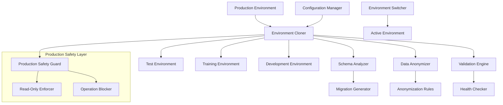

# Technical Documentation - Test/Training Environment Setup System

## System Architecture Overview

The Test/Training Environment Setup System is designed to automate the creation of safe, isolated environments that mirror production data and functionality while protecting sensitive information through anonymization.

### High-Level Architecture



### Core Components

#### 1. Environment Cloner
**Purpose**: Orchestrates the complete environment cloning process
**Location**: `lib/environment-management/cloner/`
**Key Responsibilities**:
- Coordinates schema and data cloning operations
- Manages production safety checks
- Handles backup and rollback operations
- Tracks operation progress and logging

**API Interface**:
```typescript
interface EnvironmentCloner {
  cloneEnvironment(source: Environment, target: Environment, options: CloneOptions): Promise<CloneResult>
  validateClone(environment: Environment): Promise<ValidationResult>
  rollbackClone(environment: Environment, backupId: string): Promise<void>
}
```

#### 2. Schema Analyzer
**Purpose**: Analyzes and compares database schemas between environments
**Location**: `lib/environment-management/schema/`
**Key Responsibilities**:
- Extracts complete schema definitions including tables, functions, triggers
- Compares schemas to detect differences
- Generates migration scripts with proper dependency ordering

**API Interface**:
```typescript
interface SchemaAnalyzer {
  analyzeSchema(environment: Environment): Promise<SchemaDefinition>
  compareSchemas(source: SchemaDefinition, target: SchemaDefinition): Promise<SchemaDiff>
  generateMigrationScript(diff: SchemaDiff): Promise<MigrationScript>
}
```

#### 3. Data Anonymizer
**Purpose**: Anonymizes sensitive data while preserving referential integrity
**Location**: `lib/environment-management/anonymization/`
**Key Responsibilities**:
- Applies anonymization rules to sensitive data
- Generates realistic fake data using faker.js
- Preserves relationships between tables
- Maintains data consistency and format

**API Interface**:
```typescript
interface DataAnonymizer {
  anonymizeTable(tableName: string, data: any[], rules: AnonymizationRule[]): Promise<any[]>
  generateFakeData(dataType: DataType, constraints?: any): any
  preserveRelationships(data: RelationalData): Promise<RelationalData>
}
```

#### 4. Validation Engine
**Purpose**: Validates cloned environments and ensures functionality
**Location**: `lib/environment-management/validation/`
**Key Responsibilities**:
- Runs comprehensive environment health checks
- Tests core functionality (auth, CRUD, audit, notifications)
- Generates detailed validation reports
- Monitors environment health continuously

**API Interface**:
```typescript
interface ValidationEngine {
  validateEnvironment(environment: Environment): Promise<ValidationResult>
  runHealthChecks(environment: Environment): Promise<HealthReport>
  testFunctionality(environment: Environment, tests: TestSuite[]): Promise<TestResult[]>
}
```

#### 5. Production Safety Guard
**Purpose**: Enforces strict production protection measures
**Location**: `lib/environment-management/safety/`
**Key Responsibilities**:
- Validates environment types and enforces read-only production access
- Blocks any write operations to production
- Provides multiple confirmation layers for sensitive operations
- Generates security alerts for production access attempts

**API Interface**:
```typescript
interface ProductionSafetyGuard {
  validateEnvironmentType(env: Environment): Promise<EnvironmentType>
  enforceReadOnlyAccess(connection: DatabaseConnection): Promise<void>
  blockWriteOperations(env: Environment): Promise<void>
  verifyTargetEnvironment(target: Environment): Promise<boolean>
  alertOnProductionAccess(operation: string): Promise<void>
}
```

## Data Models

### Environment Configuration
```typescript
interface Environment {
  id: string
  name: string
  type: 'production' | 'test' | 'training' | 'development'
  supabaseUrl: string
  supabaseAnonKey: string
  supabaseServiceKey: string
  databaseUrl: string
  status: 'active' | 'inactive' | 'cloning' | 'error'
  createdAt: Date
  lastUpdated: Date
  isReadOnly: boolean // Always true for production
}
```

### Clone Operation
```typescript
interface CloneOperation {
  id: string
  sourceEnvironment: string
  targetEnvironment: string
  status: 'pending' | 'in_progress' | 'completed' | 'failed'
  progress: number
  startedAt: Date
  completedAt?: Date
  logs: CloneLog[]
  statistics: CloneStatistics
  safetyChecks: SafetyCheckResult[]
}
```

### Schema Definition
```typescript
interface SchemaDefinition {
  tables: TableDefinition[]
  functions: FunctionDefinition[]
  triggers: TriggerDefinition[]
  indexes: IndexDefinition[]
  policies: PolicyDefinition[]
  schemas: string[] // audit, public, etc.
  extensions: ExtensionDefinition[]
}
```

### Anonymization Rule
```typescript
interface AnonymizationRule {
  tableName: string
  columnName: string
  anonymizationType: 'email' | 'name' | 'phone' | 'address' | 'financial' | 'custom'
  customGenerator?: (originalValue: any) => any
  preserveFormat?: boolean
  preserveRelationships?: boolean
}
```

## Database Schema Documentation

### Core Tables

#### environments
Stores environment configuration and metadata
```sql
CREATE TABLE environments (
  id UUID PRIMARY KEY DEFAULT gen_random_uuid(),
  name VARCHAR(255) NOT NULL UNIQUE,
  type environment_type NOT NULL,
  supabase_url TEXT NOT NULL,
  supabase_anon_key TEXT NOT NULL,
  supabase_service_key TEXT NOT NULL,
  database_url TEXT NOT NULL,
  status environment_status DEFAULT 'inactive',
  is_read_only BOOLEAN DEFAULT false,
  created_at TIMESTAMP WITH TIME ZONE DEFAULT NOW(),
  last_updated TIMESTAMP WITH TIME ZONE DEFAULT NOW()
);
```

#### clone_operations
Tracks all cloning operations with detailed logs
```sql
CREATE TABLE clone_operations (
  id UUID PRIMARY KEY DEFAULT gen_random_uuid(),
  source_environment_id UUID REFERENCES environments(id),
  target_environment_id UUID REFERENCES environments(id),
  status clone_status DEFAULT 'pending',
  progress INTEGER DEFAULT 0,
  started_at TIMESTAMP WITH TIME ZONE DEFAULT NOW(),
  completed_at TIMESTAMP WITH TIME ZONE,
  error_message TEXT,
  statistics JSONB,
  safety_checks JSONB
);
```

#### anonymization_rules
Defines rules for data anonymization
```sql
CREATE TABLE anonymization_rules (
  id UUID PRIMARY KEY DEFAULT gen_random_uuid(),
  table_name VARCHAR(255) NOT NULL,
  column_name VARCHAR(255) NOT NULL,
  anonymization_type anonymization_type NOT NULL,
  custom_generator TEXT,
  preserve_format BOOLEAN DEFAULT false,
  preserve_relationships BOOLEAN DEFAULT true,
  is_active BOOLEAN DEFAULT true
);
```

### Specialized System Tables

#### audit_logs_clone_tracking
Tracks audit log cloning operations
```sql
CREATE TABLE audit_logs_clone_tracking (
  id UUID PRIMARY KEY DEFAULT gen_random_uuid(),
  clone_operation_id UUID REFERENCES clone_operations(id),
  source_table VARCHAR(255) NOT NULL,
  records_cloned INTEGER DEFAULT 0,
  records_anonymized INTEGER DEFAULT 0,
  anonymization_rules_applied JSONB
);
```

#### conversation_clone_tracking
Tracks conversation system cloning
```sql
CREATE TABLE conversation_clone_tracking (
  id UUID PRIMARY KEY DEFAULT gen_random_uuid(),
  clone_operation_id UUID REFERENCES clone_operations(id),
  conversations_cloned INTEGER DEFAULT 0,
  messages_cloned INTEGER DEFAULT 0,
  participants_anonymized INTEGER DEFAULT 0
);
```

#### reservation_clone_tracking
Tracks reservation system cloning
```sql
CREATE TABLE reservation_clone_tracking (
  id UUID PRIMARY KEY DEFAULT gen_random_uuid(),
  clone_operation_id UUID REFERENCES clone_operations(id),
  reservations_cloned INTEGER DEFAULT 0,
  guests_anonymized INTEGER DEFAULT 0,
  pricing_data_anonymized INTEGER DEFAULT 0
);
```

## Component Interactions

### Clone Operation Flow
1. **Initialization**: Production Safety Guard validates source environment (read-only)
2. **Schema Analysis**: Schema Analyzer extracts and compares schemas
3. **Migration Generation**: Migration scripts generated with dependency ordering
4. **Schema Application**: Target environment schema updated
5. **Data Extraction**: Data extracted from source with streaming for large tables
6. **Data Anonymization**: Sensitive data anonymized using configured rules
7. **Data Loading**: Anonymized data loaded into target environment
8. **Validation**: Comprehensive validation of cloned environment
9. **Health Check**: Final health check and functionality testing

### Safety Check Flow
1. **Environment Type Validation**: Verify source is production, target is not
2. **Connection Validation**: Ensure production connections are read-only
3. **Operation Blocking**: Block any write operations to production
4. **Multiple Confirmations**: Require explicit confirmations for sensitive operations
5. **Audit Logging**: Log all operations with security context

## Performance Considerations

### Optimization Strategies
- **Parallel Processing**: Clone multiple tables simultaneously when no dependencies exist
- **Streaming**: Use streaming for large table transfers to minimize memory usage
- **Batch Processing**: Process data in configurable batch sizes
- **Connection Pooling**: Maintain efficient database connection pools
- **Compression**: Compress data during transfer and backup operations

### Scalability Metrics
- **Concurrent Operations**: Support up to 5 concurrent clone operations
- **Data Volume**: Tested with databases up to 100GB
- **Table Count**: Supports schemas with 500+ tables
- **Relationship Complexity**: Handles complex foreign key relationships

## Security Architecture

### Production Protection Layers
1. **Connection Level**: All production connections enforced as read-only
2. **Application Level**: Multiple validation checks before any operation
3. **Database Level**: Production database configured with restricted permissions
4. **Audit Level**: All production access logged and monitored

### Data Protection
- **Anonymization**: Comprehensive anonymization of all PII data
- **Encryption**: All data encrypted in transit and at rest
- **Access Control**: Role-based access to cloning operations
- **Audit Trail**: Complete audit trail of all operations

## Monitoring and Logging

### Operation Monitoring
- **Real-time Progress**: Live progress tracking for all operations
- **Performance Metrics**: Detailed performance metrics collection
- **Error Tracking**: Comprehensive error logging and alerting
- **Resource Usage**: Monitor CPU, memory, and network usage

### Health Monitoring
- **Environment Health**: Continuous health monitoring of all environments
- **Functionality Testing**: Automated functionality testing
- **Alert System**: Automated alerting for issues and failures
- **Dashboard**: Real-time dashboard for operation monitoring

## API Documentation

### REST API Endpoints

#### Environment Management
```
GET    /api/environments              # List all environments
POST   /api/environments              # Create new environment
GET    /api/environments/:id          # Get environment details
PUT    /api/environments/:id          # Update environment
DELETE /api/environments/:id          # Delete environment
```

#### Clone Operations
```
POST   /api/clone                     # Start clone operation
GET    /api/clone/:id                 # Get clone operation status
POST   /api/clone/:id/cancel          # Cancel clone operation
POST   /api/clone/:id/rollback        # Rollback clone operation
```

#### Validation
```
POST   /api/validate/:environmentId   # Validate environment
GET    /api/health/:environmentId     # Get environment health
POST   /api/test/:environmentId       # Run functionality tests
```

### CLI Commands

#### Environment Operations
```bash
# Clone environment
npm run clone --source=production --target=test --anonymize

# Validate environment
npm run validate --environment=test

# Switch environment
npm run switch --environment=test

# Reset environment
npm run reset --environment=test --confirm
```

#### Schema Operations
```bash
# Compare schemas
npm run schema:compare --source=production --target=test

# Generate migration
npm run schema:migrate --source=production --target=test

# Apply migration
npm run schema:apply --target=test --migration=migration_001.sql
```

This technical documentation provides a comprehensive overview of the system architecture, components, and interactions for the Test/Training Environment Setup System.