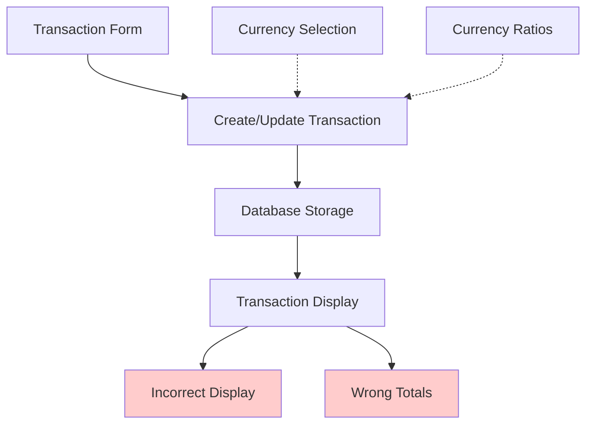
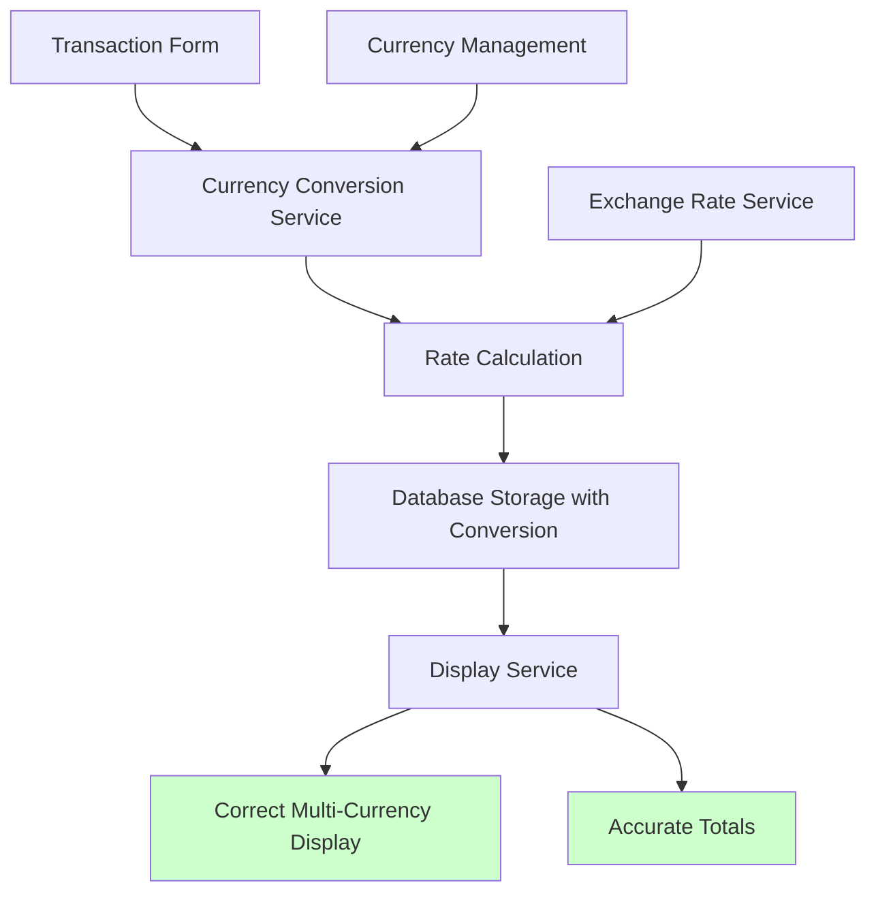

# Design Document

## Overview

Le système de transactions présente actuellement des défaillances critiques dans la gestion des devises et des conversions. Bien que l'infrastructure de base existe (tables `currencies`, champs `ratio_at_transaction` et `equivalent_amount_default_currency`), l'implémentation est incomplète et génère des erreurs d'affichage et de calcul.

Cette conception vise à corriger et compléter le système de conversion de devises pour assurer une gestion précise et cohérente des transactions multi-devises.

## Architecture

### Architecture Actuelle (Problématique)



### Architecture Cible (Solution)



## Components and Interfaces

### 1. Currency Conversion Service

**Responsabilité:** Gérer les conversions de devises et les calculs de taux de change.

```typescript
interface CurrencyConversionService {
  calculateConversion(
    amount: number,
    fromCurrencyId: string,
    toCurrencyId: string
  ): Promise<ConversionResult>
  
  getExchangeRate(
    fromCurrencyId: string,
    toCurrencyId: string
  ): Promise<number>
  
  getDefaultCurrency(): Promise<Currency>
}

interface ConversionResult {
  originalAmount: number
  convertedAmount: number
  exchangeRate: number
  fromCurrency: Currency
  toCurrency: Currency
  timestamp: Date
}
```

### 2. Transaction Service (Enhanced)

**Responsabilité:** Gérer les transactions avec conversion automatique.

```typescript
interface EnhancedTransactionService {
  createTransaction(data: TransactionInput): Promise<Transaction>
  updateTransaction(id: string, data: TransactionInput): Promise<Transaction>
  getTransactionWithConversion(id: string): Promise<TransactionWithConversion>
  calculateTotals(transactions: Transaction[]): Promise<TransactionTotals>
}

interface TransactionWithConversion extends Transaction {
  originalAmount: number
  originalCurrency: Currency
  convertedAmount: number
  defaultCurrency: Currency
  exchangeRateUsed: number
  conversionTimestamp: Date
}
```

### 3. Display Service

**Responsabilité:** Formater l'affichage des montants et devises.

```typescript
interface CurrencyDisplayService {
  formatAmount(amount: number, currency: Currency): string
  formatConversion(
    originalAmount: number,
    originalCurrency: Currency,
    convertedAmount: number,
    defaultCurrency: Currency
  ): string
  shouldShowConversion(
    transactionCurrency: Currency,
    defaultCurrency: Currency
  ): boolean
}
```

## Data Models

### Enhanced Transaction Model

```typescript
interface Transaction {
  id: string
  amount: number // Montant original dans la devise sélectionnée
  transaction_type: 'income' | 'expense'
  status: 'pending' | 'completed' | 'failed'
  description: string
  date: string
  category: string
  loft_id?: string
  
  // Champs de devise (existants mais mal utilisés)
  currency_id: string
  ratio_at_transaction: number // Taux utilisé lors de la transaction
  equivalent_amount_default_currency: number // Montant converti
  
  // Nouveaux champs pour améliorer la traçabilité
  conversion_timestamp?: Date
  exchange_rate_source?: string
}
```

### Currency Model (Existing)

```typescript
interface Currency {
  id: string
  code: string // 'DZD', 'EUR', 'CAD', etc.
  name: string
  symbol: string // 'DA', '€', 'C$', etc.
  is_default: boolean
  ratio: number // Ratio par rapport à la devise de base
  created_at: Date
}
```

## Error Handling

### 1. Conversion Errors

```typescript
enum ConversionErrorType {
  CURRENCY_NOT_FOUND = 'CURRENCY_NOT_FOUND',
  INVALID_RATE = 'INVALID_RATE',
  CALCULATION_ERROR = 'CALCULATION_ERROR',
  DEFAULT_CURRENCY_MISSING = 'DEFAULT_CURRENCY_MISSING'
}

interface ConversionError {
  type: ConversionErrorType
  message: string
  fallbackAction: 'USE_DEFAULT_RATE' | 'SHOW_WARNING' | 'BLOCK_TRANSACTION'
}
```

### 2. Fallback Strategies

- **Taux manquant:** Utiliser un ratio 1:1 avec avertissement
- **Devise par défaut introuvable:** Utiliser la première devise disponible
- **Erreur de calcul:** Afficher le montant original sans conversion

### 3. User Feedback

- Messages d'avertissement pour les conversions approximatives
- Indicateurs visuels pour les montants convertis
- Tooltips explicatifs sur les taux de change utilisés

## Testing Strategy

### 1. Unit Tests

- **Currency Conversion Service**
  - Test des calculs de conversion avec différents taux
  - Test des cas d'erreur (devise inexistante, taux invalide)
  - Test des fallbacks

- **Transaction Service**
  - Test de création avec conversion automatique
  - Test de mise à jour avec recalcul
  - Test des totaux avec devises mixtes

- **Display Service**
  - Test du formatage des montants
  - Test de l'affichage des conversions
  - Test des conditions d'affichage

### 2. Integration Tests

- **Transaction Flow**
  - Création d'une transaction en devise étrangère
  - Vérification de la conversion automatique
  - Vérification de l'affichage correct

- **Multi-Currency Scenarios**
  - Transactions dans différentes devises
  - Calcul des totaux mixtes
  - Affichage cohérent dans les listes

### 3. E2E Tests

- **User Journey**
  - Saisie d'une transaction en CAD
  - Vérification de l'affichage "X CAD ≈ Y DA"
  - Vérification des totaux corrects

- **Edge Cases**
  - Devise par défaut manquante
  - Taux de change à zéro
  - Montants très grands/petits

## Implementation Phases

### Phase 1: Core Conversion Logic
- Implémentation du CurrencyConversionService
- Correction des actions createTransaction/updateTransaction
- Tests unitaires de base

### Phase 2: Display Improvements
- Correction de l'affichage dans les composants
- Implémentation du CurrencyDisplayService
- Amélioration des totaux

### Phase 3: Error Handling & UX
- Gestion des erreurs et fallbacks
- Messages d'avertissement utilisateur
- Indicateurs visuels pour les conversions

### Phase 4: Testing & Validation
- Tests d'intégration complets
- Tests E2E des scénarios utilisateur
- Validation avec données réelles

## Performance Considerations

- **Caching des taux de change:** Éviter les recalculs répétés
- **Lazy loading:** Charger les devises seulement quand nécessaire
- **Batch calculations:** Optimiser les calculs de totaux pour les grandes listes
- **Database indexing:** Index sur currency_id pour les requêtes rapides

## Security Considerations

- **Validation des montants:** Empêcher les montants négatifs ou invalides
- **Audit trail:** Tracer les modifications de conversion
- **Rate manipulation:** Protéger contre la manipulation des taux
- **Precision handling:** Gérer correctement les arrondis financiers