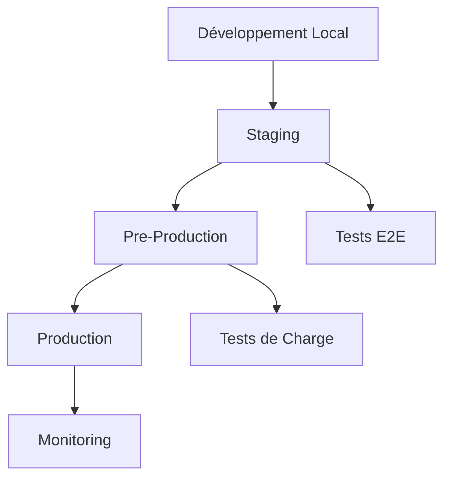

# Procédures de Déploiement - Next.js 16 Loft Algérie

**Version :** 1.0  
**Date :** 30 Décembre 2024  
**Framework :** Next.js 16.1.1  

---

## 🎯 Vue d'Ensemble

Ce document détaille les nouvelles procédures de déploiement pour l'application Loft Algérie après la migration vers Next.js 16.1.1. Il inclut les procédures pour tous les environnements et les protocoles de sécurité.

---

## 🏗️ Architecture de Déploiement

### Environnements


```mermaid
graph TD
    A[Développement Local] --> B[Staging]
    B --> C[Pre-Production]
    C --> D[Production]
    
    B --> E[Tests E2E]
    C --> F[Tests de Charge]
    D --> G[Monitoring]
```

| Environnement | URL | Objectif | Auto-Deploy |
|---------------|-----|----------|-------------|
| **Development** | localhost:3000 | Développement local | Non |
| **Staging** | staging.loft-algerie.com | Tests d'intégration | Oui (main branch) |
| **Pre-Production** | preprod.loft-algerie.com | Tests finaux | Manuel |
| **Production** | loft-algerie.com | Application live | Manuel |

---

## 🚀 Procédures de Déploiement

### 1. Déploiement en Staging

#### Pré-requis
```bash
# Vérifications préalables
node --version  # >= 18.17.0
npm --version   # >= 9.0.0
git status      # Working directory clean
```

#### Processus Automatisé
```yaml
# .github/workflows/deploy-staging.yml
name: Deploy to Staging
on:
  push:
    branches: [main]

jobs:
  deploy:
    runs-on: ubuntu-latest
    steps:
      - uses: actions/checkout@v4
      
      - name: Setup Node.js
        uses: actions/setup-node@v4
        with:
          node-version: '18.17.0'
          cache: 'npm'
      
      - name: Install dependencies
        run: npm ci
      
      - name: Run tests
        run: |
          npm run test:unit
          npm run test:integration
      
      - name: Build application
        run: npm run build
        env:
          NODE_ENV: production
          NEXT_PUBLIC_APP_ENV: staging
      
      - name: Deploy to Staging
        run: npm run deploy:staging
        env:
          DEPLOY_TOKEN: ${{ secrets.STAGING_DEPLOY_TOKEN }}
      
      - name: Run E2E tests
        run: npm run test:e2e:staging
      
      - name: Notify team
        if: failure()
        run: npm run notify:deployment-failed
```

#### Commandes Manuelles
```bash
# 1. Préparation
git checkout main
git pull origin main
npm ci

# 2. Tests pré-déploiement
npm run test:all
npm run lint
npm run type-check

# 3. Build
npm run build:staging

# 4. Déploiement
npm run deploy:staging

# 5. Validation post-déploiement
npm run validate:staging
```

### 2. Déploiement en Pre-Production

#### Checklist Pré-Déploiement
- [ ] Tests de staging réussis
- [ ] Code review approuvé
- [ ] Tests de performance validés
- [ ] Documentation mise à jour
- [ ] Plan de rollback préparé

#### Processus de Déploiement
```bash
# 1. Création de la release
git checkout main
git tag -a v1.0.0 -m "Release v1.0.0 - Next.js 16 migration"
git push origin v1.0.0

# 2. Build de pre-production
npm run build:preprod

# 3. Tests de charge
npm run test:load --env=preprod

# 4. Déploiement
npm run deploy:preprod --tag=v1.0.0

# 5. Tests de validation
npm run test:smoke:preprod
npm run test:security:preprod

# 6. Monitoring initial
npm run monitor:preprod --duration=30m
```

### 3. Déploiement en Production

#### Fenêtre de Déploiement
- **Jours :** Mardi à Jeudi
- **Heures :** 14h00 - 16h00 CET (faible trafic)
- **Durée :** Maximum 2 heures
- **Rollback :** Possible jusqu'à 18h00

#### Équipe de Déploiement
| Rôle | Responsabilité | Contact |
|------|----------------|---------|
| **Release Manager** | Coordination générale | [email] |
| **Lead Developer** | Validation technique | [email] |
| **DevOps Engineer** | Infrastructure | [email] |
| **QA Lead** | Tests de validation | [email] |

#### Processus Détaillé

##### Phase 1 : Préparation (30 min)
```bash
# 1. Vérification de l'environnement
npm run env:check:production

# 2. Backup complet
npm run backup:full --env=production

# 3. Notification équipe
npm run notify:deployment-start

# 4. Activation du mode maintenance (optionnel)
npm run maintenance:enable --message="Mise à jour en cours"
```

##### Phase 2 : Déploiement (45 min)
```bash
# 1. Build de production
npm run build:production

# 2. Tests finaux
npm run test:production-ready

# 3. Déploiement progressif
npm run deploy:production --strategy=blue-green

# 4. Validation immédiate
npm run validate:production --quick
```

##### Phase 3 : Validation (30 min)
```bash
# 1. Tests de fumée
npm run test:smoke:production

# 2. Tests critiques
npm run test:critical-path

# 3. Monitoring des métriques
npm run monitor:production --duration=15m

# 4. Désactivation du mode maintenance
npm run maintenance:disable
```

##### Phase 4 : Monitoring (15 min)
```bash
# 1. Vérification des logs
npm run logs:check --level=error --since=deployment

# 2. Métriques de performance
npm run metrics:check --baseline=pre-deployment

# 3. Notification de succès
npm run notify:deployment-success
```

---

## 🔄 Stratégies de Déploiement

### 1. Blue-Green Deployment

#### Configuration
```javascript
// deployment/blue-green.config.js
module.exports = {
  environments: {
    blue: {
      url: 'blue.loft-algerie.com',
      instances: 2,
      healthCheck: '/api/health'
    },
    green: {
      url: 'green.loft-algerie.com', 
      instances: 2,
      healthCheck: '/api/health'
    }
  },
  switchover: {
    healthCheckTimeout: 300, // 5 minutes
    rollbackTimeout: 600,    // 10 minutes
    trafficSplit: [0, 100]   // 0% blue, 100% green
  }
}
```

#### Processus
```bash
# 1. Déploiement sur l'environnement inactif (green)
npm run deploy:green

# 2. Tests sur green
npm run test:green --comprehensive

# 3. Basculement du trafic
npm run traffic:switch --from=blue --to=green

# 4. Monitoring post-basculement
npm run monitor:switchover --duration=30m

# 5. Arrêt de l'ancien environnement (blue)
npm run environment:stop --env=blue
```

### 2. Rolling Deployment

#### Configuration
```javascript
// deployment/rolling.config.js
module.exports = {
  instances: 4,
  strategy: 'rolling',
  batchSize: 1,           // Une instance à la fois
  healthCheckDelay: 30,   // 30 secondes
  maxUnavailable: 1       // Maximum 1 instance indisponible
}
```

#### Processus
```bash
# Déploiement progressif instance par instance
npm run deploy:rolling --batch-size=1 --health-check-delay=30s
```

### 3. Canary Deployment

#### Configuration
```javascript
// deployment/canary.config.js
module.exports = {
  phases: [
    { traffic: 5,  duration: '10m' },  // 5% du trafic pendant 10 min
    { traffic: 25, duration: '20m' },  // 25% du trafic pendant 20 min
    { traffic: 50, duration: '30m' },  // 50% du trafic pendant 30 min
    { traffic: 100, duration: 'inf' }  // 100% du trafic
  ],
  rollbackTriggers: {
    errorRate: 5,      // > 5% d'erreurs
    responseTime: 5000 // > 5 secondes
  }
}
```

---

## 🛡️ Sécurité du Déploiement

### Authentification et Autorisation

#### Accès aux Environnements
```bash
# Configuration des clés SSH
ssh-keygen -t ed25519 -C "deployment@loft-algerie.com"

# Ajout aux serveurs autorisés
ssh-copy-id -i ~/.ssh/deployment_key.pub user@production-server
```

#### Tokens de Déploiement
```bash
# Génération de token sécurisé
npm run auth:generate-deploy-token --env=production --expires=24h

# Utilisation du token
export DEPLOY_TOKEN="secure_token_here"
npm run deploy:production --token=$DEPLOY_TOKEN
```

### Chiffrement et Secrets

#### Gestion des Secrets
```bash
# Chiffrement des variables d'environnement
npm run secrets:encrypt --file=.env.production

# Déchiffrement lors du déploiement
npm run secrets:decrypt --env=production --key=$ENCRYPTION_KEY
```

#### Validation des Certificats
```bash
# Vérification SSL avant déploiement
npm run ssl:verify --domain=loft-algerie.com

# Renouvellement automatique
npm run ssl:auto-renew --domains=loft-algerie.com,www.loft-algerie.com
```

---

## 📊 Monitoring du Déploiement

### Métriques Clés

#### Performance
```javascript
const deploymentMetrics = {
  responseTime: {
    baseline: 2000,    // 2 secondes
    threshold: 3000,   // 3 secondes max
    critical: 5000     // 5 secondes critique
  },
  errorRate: {
    baseline: 0.5,     // 0.5%
    threshold: 2,      // 2% max
    critical: 5        // 5% critique
  },
  throughput: {
    baseline: 100,     // 100 req/s
    threshold: 80,     // 80 req/s min
    critical: 50       // 50 req/s critique
  }
}
```

#### Santé de l'Application
```bash
# Health check complet
curl -f https://loft-algerie.com/api/health

# Réponse attendue
{
  "status": "healthy",
  "timestamp": "2024-12-30T12:00:00Z",
  "version": "1.0.0",
  "services": {
    "database": "healthy",
    "redis": "healthy",
    "storage": "healthy"
  },
  "metrics": {
    "uptime": 3600,
    "memory": "45MB",
    "cpu": "12%"
  }
}
```

### Alertes de Déploiement

#### Configuration des Alertes
```javascript
// monitoring/deployment-alerts.js
const alertConfig = {
  channels: {
    slack: '#deployments',
    email: 'ops-team@loft-algerie.com',
    sms: '+33XXXXXXXXX' // Urgences uniquement
  },
  triggers: {
    deploymentStart: 'info',
    deploymentSuccess: 'info', 
    deploymentFailure: 'critical',
    rollbackTriggered: 'warning',
    performanceDegradation: 'warning'
  }
}
```

---

## 🔙 Procédures de Rollback

### Rollback Automatique

#### Déclencheurs
```javascript
const rollbackTriggers = {
  errorRate: 5,           // > 5% d'erreurs
  responseTime: 5000,     // > 5 secondes
  healthCheckFail: 3,     // 3 échecs consécutifs
  criticalServiceDown: 1  // Service critique indisponible
}
```

#### Processus Automatique
```bash
# Configuration du rollback automatique
npm run rollback:configure --triggers=error-rate:5,response-time:5000

# Activation du monitoring
npm run rollback:monitor --enable
```

### Rollback Manuel

#### Rollback Rapide (< 5 min)
```bash
# 1. Arrêt du déploiement en cours
npm run deploy:abort

# 2. Basculement vers la version précédente
npm run rollback:quick --to-version=previous

# 3. Vérification immédiate
npm run health:check --timeout=60s
```

#### Rollback Complet (< 15 min)
```bash
# 1. Backup de l'état actuel
npm run backup:current-state

# 2. Restauration complète
npm run rollback:full --to-version=v0.9.9 --include-database

# 3. Tests de validation
npm run test:rollback-validation

# 4. Notification équipe
npm run notify:rollback-completed
```

---

## 📋 Checklists de Déploiement

### Pre-Deployment Checklist

#### Technique
- [ ] Tests unitaires passent (100%)
- [ ] Tests d'intégration passent (100%)
- [ ] Tests E2E passent (> 95%)
- [ ] Build de production réussi
- [ ] Analyse de sécurité OK
- [ ] Performance baseline établie

#### Opérationnel
- [ ] Équipe de déploiement disponible
- [ ] Fenêtre de maintenance confirmée
- [ ] Plan de rollback validé
- [ ] Monitoring configuré
- [ ] Communication utilisateurs envoyée

#### Business
- [ ] Validation métier obtenue
- [ ] Impact business évalué
- [ ] Support client informé
- [ ] Documentation utilisateur prête

### Post-Deployment Checklist

#### Validation Immédiate (0-15 min)
- [ ] Application accessible
- [ ] Health checks OK
- [ ] Fonctionnalités critiques testées
- [ ] Métriques dans les seuils
- [ ] Logs sans erreurs critiques

#### Validation Étendue (15-60 min)
- [ ] Tests de fumée complets
- [ ] Performance validée
- [ ] Intégrations tierces OK
- [ ] Notifications fonctionnelles
- [ ] Rapports générés correctement

#### Suivi Long Terme (1-24h)
- [ ] Monitoring continu activé
- [ ] Métriques business stables
- [ ] Feedback utilisateurs positif
- [ ] Aucun incident reporté
- [ ] Documentation mise à jour

---

## 🚨 Gestion des Incidents

### Classification des Incidents

| Niveau | Impact | Temps de Réponse | Escalation |
|--------|--------|------------------|------------|
| **P0 - Critique** | Service indisponible | < 15 min | Immédiate |
| **P1 - Majeur** | Fonctionnalité critique | < 30 min | 1 heure |
| **P2 - Mineur** | Fonctionnalité secondaire | < 2 heures | 4 heures |
| **P3 - Cosmétique** | Interface/UX | < 24 heures | 48 heures |

### Procédure d'Incident

#### Détection
```bash
# Monitoring automatique
npm run monitor:incident-detection --enable

# Alertes configurées
npm run alerts:configure --critical-only
```

#### Réponse
```bash
# 1. Évaluation rapide
npm run incident:assess --severity=auto

# 2. Notification équipe
npm run incident:notify --level=P0

# 3. Activation du plan d'urgence
npm run emergency:activate --incident-id=INC-001
```

#### Résolution
```bash
# 1. Diagnostic
npm run incident:diagnose --incident-id=INC-001

# 2. Application du fix
npm run incident:fix --strategy=rollback

# 3. Validation
npm run incident:validate --comprehensive
```

---

## 📞 Contacts et Support

### Équipe de Déploiement

| Rôle | Nom | Email | Téléphone | Disponibilité |
|------|-----|-------|-----------|---------------|
| **Release Manager** | [Nom] | [email] | [tel] | Heures ouvrables |
| **DevOps Lead** | [Nom] | [email] | [tel] | 24/7 |
| **Security Officer** | [Nom] | [email] | [tel] | Sur appel |
| **Business Owner** | [Nom] | [email] | [tel] | Heures ouvrables |

### Escalation d'Urgence

1. **Niveau 1** - Équipe technique (0-15 min)
2. **Niveau 2** - Management technique (15-30 min)  
3. **Niveau 3** - Direction technique (30-60 min)
4. **Niveau 4** - Direction générale (> 60 min)

### Outils de Communication

- **Slack :** #loft-algerie-deployments
- **Email :** deployments@loft-algerie.com
- **Hotline :** +33 X XX XX XX XX
- **Status Page :** status.loft-algerie.com

---

**Document maintenu par l'équipe DevOps**  
**Dernière mise à jour :** 30 Décembre 2024  
**Prochaine révision :** 30 Mars 2025