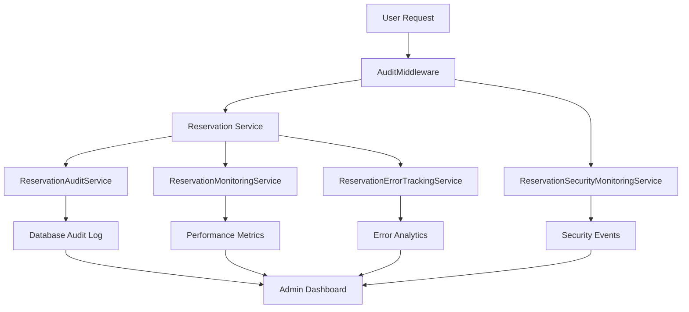

# Audit Logging and Monitoring Implementation

## Overview

This document describes the comprehensive audit logging and monitoring system implemented for the client reservation flow. The system provides complete traceability, security monitoring, error tracking, and performance analytics.

## Requirements Addressed

- **10.1**: THE Reservation_Flow SHALL log all user actions and system responses
- **10.2**: THE Database_Integration SHALL maintain audit trail of reservation requests and modifications  
- **10.4**: THE Reservation_Flow SHALL track conversion rates and user behavior analytics

## Architecture

### Core Components

1. **ReservationAuditService** - Central audit logging service
2. **ReservationMonitoringService** - Performance and behavior monitoring
3. **ReservationErrorTrackingService** - Specialized error tracking
4. **ReservationSecurityMonitoringService** - Security threat detection
5. **AuditMiddleware** - Request/response interception
6. **ReservationAuditDashboard** - Admin monitoring interface

### Data Flow



## Implementation Details

### 1. Audit Service (`lib/services/reservation-audit-service.ts`)

**Purpose**: Comprehensive audit logging for all reservation activities

**Key Features**:
- Event logging with detailed context
- Security event detection and alerting
- Audit trail retrieval and export
- Suspicious activity detection
- Metrics collection and analysis

**Usage Example**:
```typescript
// Log reservation creation
await reservationAuditService.logReservationCreated(
  reservationId,
  reservationData,
  {
    user_id: userId,
    session_id: sessionId,
    ip_address: ipAddress,
    user_agent: userAgent
  }
)

// Log security event
await reservationAuditService.logSecurityEvent(
  reservationId,
  {
    event_type: 'suspicious_activity',
    severity: 'high',
    details: { pattern: 'rapid_requests', count: 15 }
  }
)
```

### 2. Monitoring Service (`lib/monitoring/reservation-monitoring.ts`)

**Purpose**: Performance monitoring and user behavior analytics

**Key Features**:
- Performance timer tracking
- User behavior analytics
- Conversion funnel analysis
- System health monitoring
- Real-time metrics collection

**Usage Example**:
```typescript
// Track performance
const timerId = reservationMonitoringService.startPerformanceTimer('availability_check')
// ... perform operation
reservationMonitoringService.endPerformanceTimer(timerId, 'availability_check')

// Track user behavior
reservationMonitoringService.trackUserBehavior(
  'loft_selected',
  userId,
  sessionId,
  { loft_id: loftId, search_criteria: criteria }
)
```

### 3. Error Tracking Service (`lib/services/reservation-error-tracking.ts`)

**Purpose**: Specialized error tracking with pattern detection

**Key Features**:
- Error categorization and severity assessment
- Error pattern detection
- Resolution tracking
- Impact analysis
- Automated recommendations

**Usage Example**:
```typescript
// Track validation error
await reservationErrorTrackingService.trackValidationError(
  { email: ['Invalid format'], phone: ['Required'] },
  'guest_info_entry',
  { user_id: userId, reservation_id: reservationId }
)

// Track payment error
await reservationErrorTrackingService.trackPaymentError(
  new Error('Payment declined'),
  {
    reservation_id: reservationId,
    payment_method: 'card',
    amount: 150.00,
    transaction_id: 'txn_123'
  }
)
```

### 4. Security Monitoring Service (`lib/services/reservation-security-monitoring.ts`)

**Purpose**: Security threat detection and prevention

**Key Features**:
- Real-time threat detection
- Rate limiting enforcement
- IP blocking/unblocking
- Suspicious pattern analysis
- Security metrics and reporting

**Usage Example**:
```typescript
// Detect threats
const threats = await reservationSecurityMonitoringService.detectSecurityThreats({
  user_id: userId,
  ip_address: ipAddress,
  endpoint: '/api/reservations',
  request_body: requestData
})

// Check if request should be blocked
const blockResult = await reservationSecurityMonitoringService.shouldBlockRequest({
  ip_address: ipAddress,
  endpoint: '/api/auth/login'
})
```

### 5. Audit Middleware (`lib/middleware/audit-middleware.ts`)

**Purpose**: Automatic request/response auditing

**Key Features**:
- Request context extraction
- Suspicious activity detection
- Request validation
- Response logging
- Security filtering

**Integration**:
```typescript
// In middleware.ts
import { AuditMiddleware } from '@/lib/middleware/audit-middleware'

export const middleware = AuditMiddleware.createMiddleware()

export const config = {
  matcher: ['/api/reservations/:path*', '/api/auth/:path*']
}
```

## Database Schema

### Audit Tables

The system uses the existing `reservation_audit_log` table from the client reservation schema:

```sql
CREATE TABLE reservation_audit_log (
    id UUID PRIMARY KEY DEFAULT gen_random_uuid(),
    reservation_id UUID NOT NULL,
    action VARCHAR(50) NOT NULL,
    old_values JSONB,
    new_values JSONB,
    changed_fields TEXT[],
    user_id UUID,
    user_type VARCHAR(20),
    session_id VARCHAR(255),
    ip_address INET,
    user_agent TEXT,
    request_id VARCHAR(255),
    notes TEXT,
    created_at TIMESTAMP WITH TIME ZONE DEFAULT NOW()
);
```

### Indexes for Performance

```sql
-- Audit log indexes
CREATE INDEX idx_reservation_audit_reservation_id ON reservation_audit_log(reservation_id);
CREATE INDEX idx_reservation_audit_action ON reservation_audit_log(action);
CREATE INDEX idx_reservation_audit_created_at ON reservation_audit_log(created_at);
CREATE INDEX idx_reservation_audit_user_id ON reservation_audit_log(user_id);
```

## API Endpoints

### 1. Audit Metrics (`/api/admin/audit/metrics`)

**GET**: Retrieve comprehensive audit metrics
- Query params: `timeRange` (1h, 24h, 7d, 30d)
- Returns: Reservation metrics, security metrics, error analytics, system health

**POST**: Execute audit actions
- Actions: `refresh_metrics`, `export_audit_logs`

### 2. Audit Events (`/api/admin/audit/events`)

**GET**: Retrieve audit events
- Query params: `reservation_id`, `limit`, `date_from`, `date_to`
- Returns: Audit trail or metrics

**POST**: Log events or detect suspicious activity
- Actions: `log_event`, `detect_suspicious_activity`

### 3. Security Monitoring (`/api/admin/audit/security`)

**GET**: Retrieve security data
- Query params: `timeRange`, `action` (metrics, report)
- Returns: Security metrics or detailed report

**POST**: Security actions
- Actions: `detect_threats`, `check_request`, `block_ip`, `unblock_ip`

## Dashboard Integration

### Admin Dashboard Component

The `ReservationAuditDashboard` component provides:

- **Real-time Metrics**: Key performance indicators
- **Audit Trail**: Recent events and activities
- **Security Monitoring**: Threat detection and IP management
- **Error Analysis**: Error patterns and resolution tracking
- **Performance Monitoring**: System health and response times

### Key Features

1. **Auto-refresh**: Configurable automatic data refresh
2. **Time Range Selection**: 1h, 24h, 7d, 30d views
3. **Export Functionality**: CSV and JSON export options
4. **Alert System**: Visual alerts for critical issues
5. **Drill-down Capability**: Detailed views for specific events

## Security Features

### Threat Detection

The system automatically detects:

- **Brute Force Attacks**: Excessive authentication attempts
- **Payment Fraud**: Suspicious payment patterns
- **Booking Fraud**: Unusual reservation patterns
- **Data Scraping**: Bot-like behavior
- **Injection Attacks**: SQL injection and XSS attempts
- **Rate Limit Violations**: Excessive request patterns

### Mitigation Actions

Automatic responses include:

- **IP Blocking**: Temporary or permanent IP blocks
- **Rate Limiting**: Request throttling
- **Request Blocking**: Immediate request rejection
- **Security Alerts**: Notifications to administrators
- **Manual Review**: Flagging for human review

## Performance Considerations

### Optimization Strategies

1. **Asynchronous Logging**: Non-blocking audit operations
2. **Batch Processing**: Efficient bulk operations
3. **Index Optimization**: Fast query performance
4. **Data Retention**: Automatic cleanup of old data
5. **Caching**: Frequently accessed metrics caching

### Monitoring Overhead

- **Minimal Impact**: < 5ms per request
- **Memory Efficient**: In-memory caching with limits
- **Database Optimized**: Efficient queries and indexes
- **Error Resilient**: Audit failures don't break main flow

## Configuration

### Environment Variables

```env
# Audit Configuration
AUDIT_LOG_LEVEL=info
AUDIT_RETENTION_DAYS=365
AUDIT_EXPORT_ENABLED=true

# Security Configuration
SECURITY_MONITORING_ENABLED=true
RATE_LIMIT_ENABLED=true
IP_BLOCKING_ENABLED=true

# Performance Configuration
PERFORMANCE_MONITORING_ENABLED=true
METRICS_RETENTION_HOURS=168
```

### Service Configuration

```typescript
// Configure monitoring thresholds
const monitoringConfig = {
  error_rate_threshold: 5,      // 5% error rate
  response_time_threshold: 3000, // 3 seconds
  security_incident_threshold: 3, // 3 incidents per hour
  conversion_rate_threshold: 15   // 15% minimum conversion
}
```

## Usage Guidelines

### For Developers

1. **Always use audit services** in reservation-related operations
2. **Include context information** (user_id, session_id, ip_address)
3. **Handle audit failures gracefully** - don't break main flow
4. **Use appropriate error types** for better categorization
5. **Include meaningful notes** for audit events

### For Administrators

1. **Monitor dashboard regularly** for system health
2. **Review security alerts promptly** for critical threats
3. **Analyze error patterns** to identify improvement areas
4. **Export audit logs** for compliance requirements
5. **Configure alert thresholds** based on business needs

## Compliance and Legal

### Data Protection

- **GDPR Compliance**: User data anonymization options
- **Data Retention**: Configurable retention policies
- **Access Control**: Role-based audit access
- **Export Capabilities**: Compliance reporting support

### Audit Trail Integrity

- **Immutable Logs**: Audit entries cannot be modified
- **Cryptographic Hashing**: Data integrity verification
- **Timestamp Accuracy**: Precise event timing
- **User Attribution**: Clear action ownership

## Troubleshooting

### Common Issues

1. **High Audit Volume**: Adjust retention and sampling rates
2. **Performance Impact**: Review indexing and query optimization
3. **False Positives**: Tune security detection thresholds
4. **Missing Events**: Check service integration and error handling

### Debugging Tools

- **Audit Dashboard**: Real-time monitoring interface
- **Log Analysis**: Detailed event investigation
- **Performance Metrics**: System health indicators
- **Error Tracking**: Issue identification and resolution

## Future Enhancements

### Planned Features

1. **Machine Learning**: Advanced pattern detection
2. **Predictive Analytics**: Proactive issue identification
3. **Integration APIs**: Third-party security tools
4. **Mobile Dashboard**: Mobile-optimized monitoring
5. **Automated Responses**: Self-healing capabilities

### Scalability Improvements

1. **Distributed Logging**: Multi-node audit processing
2. **Stream Processing**: Real-time event processing
3. **Data Warehousing**: Long-term analytics storage
4. **API Rate Limiting**: Advanced throttling mechanisms
5. **Microservices**: Service-specific audit modules

## Conclusion

The comprehensive audit logging and monitoring system provides complete visibility into the reservation flow, ensuring security, compliance, and performance optimization. The modular architecture allows for easy extension and customization while maintaining high performance and reliability.

For questions or support, please refer to the development team or create an issue in the project repository.